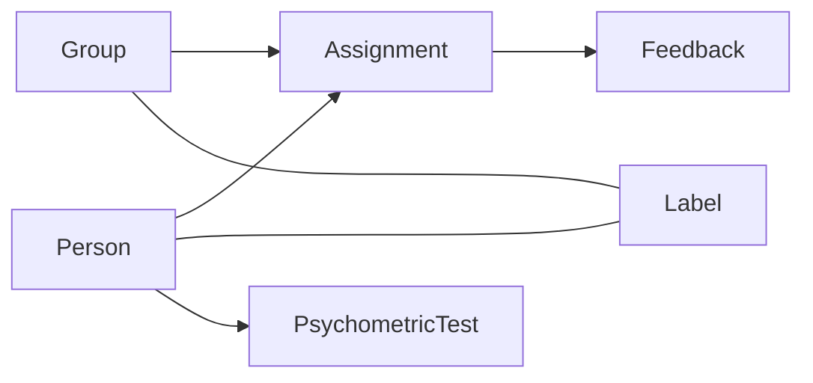
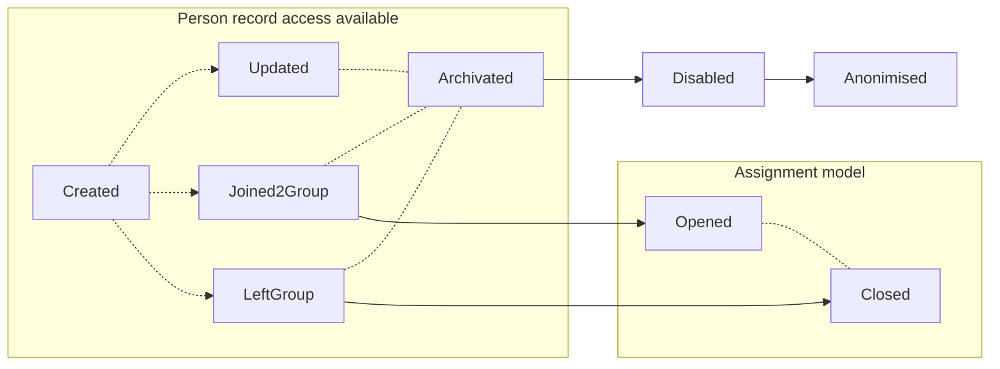

# COLY ME(Match Engine) API documentation 

Table of contents:

* [Introduction](#intro_link)
* [Description](#description_link)
* [API](#api_link)
  * [`Authentication`](#api_authentication_link)
  * [`Assignments`](#api_assignments_link)
  * [`Groups`](#api_groups_link)
  * [`Match`](#api_match_link)
  * [`Persons`](#api_persons_link)
  * [`Profile`](#api_profile_link)
  * [`Psychometry`](#api_psychometry_link)

---

#### Introduction...<a name="intro_link"></a>

Coly ME API Documentaion provides a descriptive information for developers to harness the power of ME Engine.

This page describes what's possible to build with the different tools provided and APIs that are available on the platform, and how to get the access and the information for you to get started.


#### `WIP` Data lifecycle Description<a name="description_link"></a>

Our data models have several types(or layers if you will) which define the way we approach. Simply speaking data lifecycle reveals steps and actions that should be made to reach them. 

Any model could be eather `public`, or `private`:
- `public` means that it's accessible from outside(any api consumers like: frontend  applications, client services, widgets, etc).
- `private` means that such model would be unreachable from outside and is being used solely by system internals. Usually used to extends [primary models](#primary-models) with computed data.


*Diagram1: Visualisation of model dependencies*

### Primary models
Core level models, contains crucial data for system operations.

#### `public` Person model
%description%



- `Created` - creating empty person record
- `Updated` - update client's payload data
- `Joined2Group` - creates new [`Assignment`](#public-assignment-model) record thus linking [`Person`](#public-person-model) and [`Group`](#public-group-model)
- `LeftGroup` - set's [`Assignment`](#public-assignment-model) record as inactive
- `Archivated` - changes record access rights, thus making it `read-only`. No updates or any other actions then recover are available. At the end of predefined archive record life-time it moves to state `Disabled`
- `Disabled` - restricts any futher public access to data. Life-time defined by coly data retention policy.
- `Anonimised` - record is being stripped from personal or any sensitive information. Futher access intendded solely for ML training unit.


#### `public` Group model
%description%


- `Created` - creating empty group record
- `Updated` - update client's payload data
- `PersonJoined` - creates new [`Assignment`](#public-assignment-model) record thus linking [`Person`](#public-person-model) and [`Group`](#public-group-model)
- `PersonLeft` - set's [`Assignment`](#public-assignment-model) record as inactive
- `Archivated` - changes record access rights, thus making it `read-only`. No updates or any other actions then recover are available. At the end of predefined archive record life-time it moves to state `Disabled`
- `Disabled` - restricts any futher public access to data. Life-time defined by coly data retention policy.
- `Anonimised` - record is being stripped from personal or any sensitive information. Futher access intendded solely for ML training unit.

#### `public` Assignment model
%description%

%mermaid diagram%

## API<a name="api_link"></a>

---

* Base API URL

```http
https//me-api.coly.io
```

---

<br/>

* ### Authentication<a name="api_authentication_link"></a>

<hr style="background: #0037A1; height: 7px">

Receives request to add new user and returns the user id

```http
POST /auth/register
```

##### Example request body :

```json
{
    "email": "user@example.com",
    "password": "password"
}
```

##### Response example :

```html
5e9c17b4-3eb5-49ac-8049-819ad7041311
```

<hr style="background: #0037A1">

Authorizes via credentials

```http
POST /auth/sign-in
```

##### Example request body :

```json
{
  "email": "user@example.com",
  "password": "password"
}
```

##### Response example:

```json
{
  "refreshToken": "eyJjdHkiOiJKV1QiLCJlbmMiOiJBMjU2R0NNIiwiYWxnIjoiUlNBLU9BRVAifQ.",
  "accessToken":"eyJraWQiOiJsNVRwSVFWVllrbzZLdU4wOENhSDBVQVBOOG4wRkwwTGxNZGt3d2NaY0VZPSIsImFsZyI6IlJTMjU2I",
  "idToken": "eyJraWQiOiI5dWhMbyt4c0VKbEk5alNKU0hFQVkyOTFhZUY1QkRna2FzcVFcL3ppRmV3dz0iLCJhbGciOiJSUzI1NiJ9."
}
```
<hr style="background: #0037A1">

* Refreshes session consuming refresh token

```http
POST /auth/refresh
```
<hr style="background: #0037A1">

* Completes user registration flow

```http
POST /auth/verification
```
<hr style="background: #0037A1">

* Resents the verification flow

```http
POST /auth/verification/resend
```
<hr style="background: #0037A1">

* Forgot password flow

```http
POST /auth/forgot-password
```
<hr style="background: #0037A1">

* Change password flow

```http
POST /auth/change-password
```
<hr style="background: #0037A1; height: 7px">
<br/>


* ### Assignments<a name="api_assignments_link"></a>

<hr style="background: #0037A1; height: 7px">

* Creates single assignment

```http
POST /assignments
```
##### Example request body :

```json
{
  "groupId": "3747a4ab-a385-4215-9084-5c1479019ba6",
  "personId": "11131f6e-5654-4d72-bff0-b4d60b1c9b3a"
}
```
##### Response example:

```json
{
  "id": "e73c70d1-76a1-4038-b42e-10892b4f1857",
  "createdAt": "2022-11-20T18:21:52.668Z",
  "createdBy": "72d6943c-2b64-43bf-8c38-93c83dc4edab",
  "leftAt": null,
  "isDirect": false,
  "groupId": "3747a4ab-a385-4215-9084-5c1479019ba6",
  "personId": "11131f6e-5654-4d72-bff0-b4d60b1c9b3a"
}
```
<hr style="background: #0037A1">

* Closes assignment for specified person

```http
DELETE /assignments
```
##### Example request body :

```json
{
  "personId": "11131f6e-5654-4d72-bff0-b4d60b1c9b3a"
}
```
##### Response example:

```json
{
  "id": "e73c70d1-76a1-4038-b42e-10892b4f1857",
  "createdAt": "2022-11-20T18:21:52.668Z",
  "createdBy": "72d6943c-2b64-43bf-8c38-93c83dc4edab",
  "leftAt": "2022-11-20T18:23:41.404Z",
  "isDirect": false,
  "groupId": "3747a4ab-a385-4215-9084-5c1479019ba6",
  "personId": "11131f6e-5654-4d72-bff0-b4d60b1c9b3a"
}
```

<hr style="background: #0037A1; height: 7px">
<br/>


* ### Groups<a name="api_groups_link"></a>

<hr style="background: #0037A1; height: 7px">


* Retrieves list of group records

```http
GET /groups
```
##### Response example:

```json
{
  "total": 1,
  "list": [
    {
      "id": "3747a4ab-a385-4215-9084-5c1479019ba6",
      "createdAt": "2022-10-31T15:24:51.730Z",
      "createdBy": "72d6943c-2b64-43bf-8c38-93c83dc4edab",
      "updatedAt": "2022-11-01T16:01:03.485Z",
      "updatedBy": "72d6943c-2b64-43bf-8c38-93c83dc4edab",
      "archivedAt": null,
      "archivedBy": null,
      "name": "Group A",
      "image": null,
      "capacity": 4,
      "traits": {
        "updatedAt": "2022-11-01T09:57:01.269Z",
        "traits": {
          "personality": {
          "emotionalStability": 0,
          "conscientiousness": 27.16966379985,
          "agreeableness": 2.6192337764,
          "extroversion": 85.3010164191,
          "openness": 30.6880375293
          },
          "values": {
            "selfDirection": 14.425332290850001,
            "universalism": 15.324472243899999,
            "achievement": 75.29319781075,
            "benevolence": 20.60203283815,
            "conformity": 36.2392494136,
            "tradition": 46.1884284597,
            "security": 45.19155590305,
            "hedonism": 44.05785770135,
            "activity": 63.6434714621,
            "power": 93.6669272869
          }
        }
      }
    }
  ],
  "isDone": true
}
```
<hr style="background: #0037A1">

* Retrieves basic statistic over owner's created rows

```http
GET /groups/status
```
##### Response example:

```json
{
  "available": 2,
  "unavailable": 0,
  "total": 2
}
```
<hr style="background: #0037A1">

* Retrieves single group record

```http
GET /groups/:id
```
##### Response example:

```json
{
  "id": "3747a4ab-a385-4215-9084-5c1479019ba6",
  "createdAt": "2022-10-31T15:24:51.730Z",
  "createdBy": "72d6943c-2b64-43bf-8c38-93c83dc4edab",
  "updatedAt": "2022-11-01T16:01:03.485Z",
  "updatedBy": "72d6943c-2b64-43bf-8c38-93c83dc4edab",
  "archivedAt": null,
  "archivedBy": null,
  "name": "Group A",
  "image": null,
  "capacity": 4,
  "traits": {
    "updatedAt": "2022-11-01T09:57:01.269Z",
    "traits": {
      "personality": {
        "emotionalStability": 0,
        "conscientiousness": 27.16966379985,
        "agreeableness": 2.6192337764,
        "extroversion": 85.3010164191,
        "openness": 30.6880375293
        },
      "values": {
        "selfDirection": 14.425332290850001,
        "universalism": 15.324472243899999,
        "achievement": 75.29319781075,
        "benevolence": 20.60203283815,
        "conformity": 36.2392494136,
        "tradition": 46.1884284597,
        "security": 45.19155590305,
        "hedonism": 44.05785770135,
        "activity": 63.6434714621,
        "power": 93.6669272869
      }
    }
  }
}
```

<hr style="background: #0037A1">

* Creates new group record and returns it

```http
POST /groups
```
##### Example request body :

```json
{
  "name": "Group A",
  "capacity": 4,
}
```
##### Response example :

```json
{
  "id": "8291747b-f415-4854-95ff-40c43919201c",
  "createdAt": "2022-11-17T21:13:37.601Z",
  "createdBy": "72d6943c-2b64-43bf-8c38-93c83dc4edab",
  "updatedAt": "2022-11-17T21:13:37.601Z",
  "updatedBy": "72d6943c-2b64-43bf-8c38-93c83dc4edab",
  "archivedAt": null,
  "archivedBy": null,
  "name": "Group A",
  "image": null,
  "capacity": 4,
  "traits": null
}
```
<hr style="background: #0037A1">

* Updates group record fields and returns it updated

```http
PUT /groups/:id
```
##### Example request body :

```json
{
  "name": "Group A",
  "capacity": 2,
}
```
##### Response example : changed group capacity

```json
{
  "id": "8291747b-f415-4854-95ff-40c43919201c",
  "createdAt": "2022-11-17T21:13:37.601Z",
  "createdBy": "72d6943c-2b64-43bf-8c38-93c83dc4edab",
  "updatedAt": "2022-11-17T21:13:37.601Z",
  "updatedBy": "72d6943c-2b64-43bf-8c38-93c83dc4edab",
  "archivedAt": null,
  "archivedBy": null,
  "name": "Group A",
  "image": null,
  "capacity": 2,
  "traits": null
}
```
<hr style="background: #0037A1">

* Toggles group record archived status

```http
PATCH /groups/:id/archivate
```
##### Response example : archive group

```json
{
  "id": "8291747b-f415-4854-95ff-40c43919201c",
  "createdAt": "2022-11-17T21:13:37.601Z",
  "createdBy": "72d6943c-2b64-43bf-8c38-93c83dc4edab",
  "updatedAt": "2022-11-17T22:40:37.575Z",
  "updatedBy": "72d6943c-2b64-43bf-8c38-93c83dc4edab",
  "archivedAt": "2022-11-17T22:42:26.613Z",
  "archivedBy": "72d6943c-2b64-43bf-8c38-93c83dc4edab",
  "name": "Group TMZ",
  "image": null,
  "capacity": 2,
  "traits": null
}
```

<hr style="background: #0037A1">

* Restores a group record from the archive

```http
PATCH /groups/:id/restore
```
##### Response example : restore the archived group

```json
{
  "id": "8291747b-f415-4854-95ff-40c43919201c",
  "createdAt": "2022-11-17T21:13:37.601Z",
  "createdBy": "72d6943c-2b64-43bf-8c38-93c83dc4edab",
  "updatedAt": "2022-11-17T22:40:37.575Z",
  "updatedBy": "72d6943c-2b64-43bf-8c38-93c83dc4edab",
  "archivedAt": null,
  "archivedBy": null,
  "name": "Group TMZ",
  "image": null,
  "capacity": 2,
  "traits": null
}
```
<hr style="background: #0037A1">

* Disabling group record
**Note that only the archived records can be deleted**

```http
DELETE /groups/:id
```

<hr style="background: #0037A1; height: 7px">
<br/>


* ### Match<a name="api_match_link"></a>

<hr style="background: #0037A1; height: 7px">

* Operates matching between persons and groups

```http
POST /something/to/our/rest/api
```

<hr style="background: #0037A1; height: 7px">
<br/>


#### Persons<a name="api_persons_link"></a>

<hr style="background: #0037A1; height: 7px">
* Retrieves single person record

```http
GET /persons/:id
```
##### Response example : 

```json
{
  "id": "11131f6e-5654-4d72-bff0-b4d60b1c9b3a",
  "createdAt": "2022-10-19T19:37:03.602Z",
  "createdBy": "72d6943c-2b64-43bf-8c38-93c83dc4edab",
  "updatedAt": "2022-10-19T19:37:03.602Z",
  "updatedBy": "72d6943c-2b64-43bf-8c38-93c83dc4edab",
  "archivedAt": null,
  "archivedBy": null,
  "firstname": "Test",
  "middlename": "",
  "lastname": "erfan",
  "email": "erfan@coly.io",
  "gender": null,
  "language": null,
  "city": null,
  "country": null,
  "birthDate": null,
  "psychometry": {
    "traits": {
      "personality": {
        "emotionalStability": 100,
        "conscientiousness": 100,
        "agreeableness": 100,
        "extroversion": 100,
        "openness": 100
      },
      "values": {
        "selfDirection": 68.1000781861,
        "universalism": 25.6450351837,
        "achievement": 90.2267396403,
        "benevolence": 38.7802971071,
        "conformity": 67.4745895231,
        "tradition": 88.8975762314,
        "security": 88.4284597342,
        "hedonism": 64.7380766224,
        "activity": 63.6434714621,
        "power": 93.6669272869
      }
    },
    "submittedAt": "2022-10-19T19:47:03.891Z",
    "requestedAt": "2022-10-19T19:37:03.891Z"
  }
}
```
<hr style="background: #0037A1">

* Retrieves basic statistic over owner's created rows

```http
GET /persons/stats
```
##### Response example : 
```json
{
  "pending": 2,
  "ready": 1,
  "total": 7,
  "assigned": 4
}
```
<hr style="background: #0037A1">

* Retrieves list of persons records 


```http
GET /persons
```
##### Response example : 

```json
{
  "total": 1,
  "list": [
    {
      "id": "11131f6e-5654-4d72-bff0-b4d60b1c9b3a",
      "createdAt": "2022-10-19T19:37:03.602Z",
      "createdBy": "72d6943c-2b64-43bf-8c38-93c83dc4edab",
      "updatedAt": "2022-10-19T19:37:03.602Z",
      "updatedBy": "72d6943c-2b64-43bf-8c38-93c83dc4edab",
      "archivedAt": null,
      "archivedBy": null,
      "firstname": "Test",
      "middlename": "",
      "lastname": "erfan",
      "email": "erfan@coly.io",
      "gender": null,
      "language": null,
      "city": null,
      "country": null,
      "birthDate": null,
      "psychometry": {
        "traits": {
          "personality": {
            "emotionalStability": 100,
              "conscientiousness": 100,
              "agreeableness": 100,
              "extroversion": 100,
              "openness": 100
              },
          "values": {
            "selfDirection": 68.1000781861,
            "universalism": 25.6450351837,
            "achievement": 90.2267396403,
            "benevolence": 38.7802971071,
            "conformity": 67.4745895231,
            "tradition": 88.8975762314,
            "security": 88.4284597342,
            "hedonism": 64.7380766224,
            "activity": 63.6434714621,
            "power": 93.6669272869
            }
          },
          "submittedAt": "2022-10-19T19:47:03.891Z",
          "requestedAt": "2022-10-19T19:37:03.891Z"
        }
      }
    ],
  "isDone": false
}
```
<hr style="background: #0037A1">

* Retrieves person's test / profile url link

```http
GET /persons/:id/link
```
##### Response example : 

```json
{
  "link": "{{Base_url}}/auth/163326933613260363464326d203666626d223734643d243536353d25663661333131313"
}
```
<hr style="background: #0037A1">

* Creates new persons record and returns it

```http
POST /persons
```
##### Example request body :

```json
{
  "email": "person@example.com",
  "lastname": "Bond",
  "firstname": "James"
}
```

##### Response example : 

```json
{
  "id": "993abaa6-693b-456d-b58b-424057c5f0e3",
  "createdAt": "2022-11-20T17:55:41.266Z",
  "createdBy": "72d6943c-2b64-43bf-8c38-93c83dc4edab",
  "updatedAt": "2022-11-20T17:55:41.266Z",
  "updatedBy": "72d6943c-2b64-43bf-8c38-93c83dc4edab",
  "archivedAt": null,
  "archivedBy": null,
  "firstname": "James",
  "middlename": "",
  "lastname": "Dean",
  "email": "person@example.com",
  "gender": null,
  "language": null,
  "city": null,
  "country": null,
  "birthDate": null,
  "psychometry": null
}
```
<hr style="background: #0037A1">

* Updates person record fields and returns it updated.
* Also resends invitation if pending psycho test exist.

```http
PUT /persons/:id
```
##### Example request body :

```json
{
  "email": "person@example.com",
  "lastname": "Dean",
  "firstname": "James"
}
```

##### Response example : Changed person name

```json
{
  "id": "993abaa6-693b-456d-b58b-424057c5f0e3",
  "createdAt": "2022-11-20T17:55:41.266Z",
  "createdBy": "72d6943c-2b64-43bf-8c38-93c83dc4edab",
  "updatedAt": "2022-11-20T17:55:41.266Z",
  "updatedBy": "72d6943c-2b64-43bf-8c38-93c83dc4edab",
  "archivedAt": null,
  "archivedBy": null,
  "firstname": "James",
  "middlename": "",
  "lastname": "Dean",
  "email": "person@example.com",
  "gender": null,
  "language": null,
  "city": null,
  "country": null,
  "birthDate": null,
  "psychometry": null
}
```

<hr style="background: #0037A1">

* Creates psychometric test if none and send email request.

```http
GET /persons/:id/invite
```
<hr style="background: #0037A1">

* Toggles person record archived status

```http
PATCH /persons/:id/archivate
```
#### Response example : archive person

```json
{
  "id": "993abaa6-693b-456d-b58b-424057c5f0e3",
  "createdAt": "2022-11-20T17:55:41.266Z",
  "createdBy": "72d6943c-2b64-43bf-8c38-93c83dc4edab",
  "updatedAt": "2022-11-20T17:55:41.266Z",
  "updatedBy": "72d6943c-2b64-43bf-8c38-93c83dc4edab",
  "archivedAt": "2022-11-20T18:10:01.449Z",
  "archivedBy": "72d6943c-2b64-43bf-8c38-93c83dc4edab",
  "firstname": "James",
  "middlename": "",
  "lastname": "Dean",
  "email": "person@example.com",
  "gender": null,
  "language": null,
  "city": null,
  "country": null,
  "birthDate": null,
  "psychometry": null
}
```
<hr style="background: #0037A1">

* Restores a person record from the archive

```http
PATCH /persons/:id/restore
```
##### Response example : restore the achived person

```json
{
  "id": "993abaa6-693b-456d-b58b-424057c5f0e3",
  "createdAt": "2022-11-20T17:55:41.266Z",
  "createdBy": "72d6943c-2b64-43bf-8c38-93c83dc4edab",
  "updatedAt": "2022-11-20T17:55:41.266Z",
  "updatedBy": "72d6943c-2b64-43bf-8c38-93c83dc4edab",
  "archivedAt": null,
  "archivedBy": null,
  "firstname": "James",
  "middlename": "",
  "lastname": "Dean",
  "email": "person@example.com",
  "gender": null,
  "language": null,
  "city": null,
  "country": null,
  "birthDate": null,
  "psychometry": null
}
```
<hr style="background: #0037A1">

* Disabling person record

```http
DELETE /persons/:id
```
**Note that only the archived records can be deleted**

<hr style="background: #0037A1; height: 7px">
<br/>


#### Profile<a name="api_profile_link"></a>

<hr style="background: #0037A1; height: 7px">

```http
GET /profile
```
<hr style="background: #0037A1">

```http
POST /profile/psychometry
```
<hr style="background: #0037A1">

```http
POST /profile/language
```
<hr style="background: #0037A1">

```http
POST /profile/extra
```
<hr style="background: #0037A1; height: 7px">
<br/>


#### Psychometry<a name="api_psychometry_link"></a>

<hr style="background: #0037A1; height: 7px">

```
GET /something/from/our/rest/api
```
```
POST /something/to/our/rest/api
```

<hr style="background: #0037A1; height: 7px">