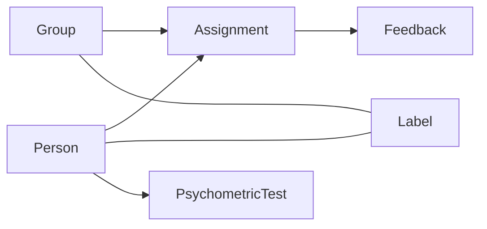
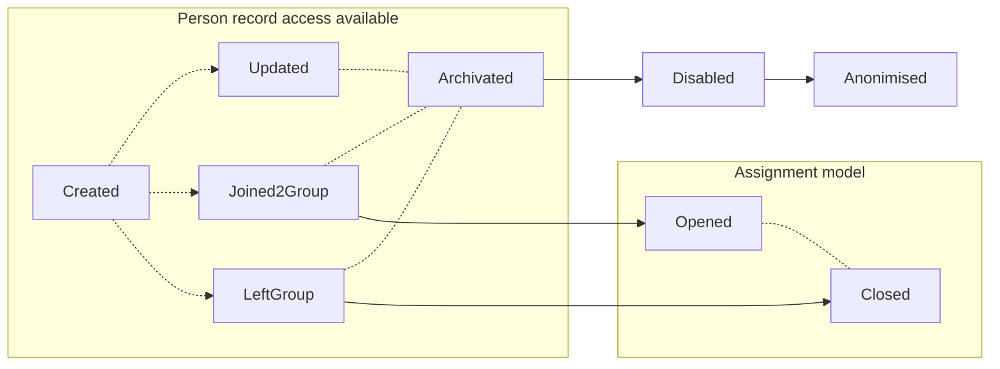

# Coly ME (Match Engine) API documentation

<hr style="background: #4C53FF; height: 5px">


<h6>Version 1.0</h6>

### Table of contents

* [Introduction](#intro_link)
* [Data Lifecycle Description](#description_link)
* [API Endpoints](#api_link)
  * [Authentication](#api_authentication_link)
    * [Exceptions](#exceptions_auth_link)
  * [Persons](#api_persons_link)
    * [Create person](#create_person_link)
    * [Get person information](#get_person_link)
    * [Get a person unique test & profile link](#get_person_test_link)
    * [Get stats of person list](#get_persons_stats_link)
    * [Get list of persons](#get_persons_list_link)
    * [Update person](#update_person_link)
    * [Person test invitation](#Person_invite_link)
    * [Archive person](#archive_person_link)
    * [Restore person from archive](#restore_person_link)
    * [Delete person from archive](#delete_person_link)
    * [Exceptions](#exceptions_person_link)
  * [Groups](#api_groups_link)
    * [Create group](#create_group_link)
    * [Get group information](#get_group_link)
    * [Get stats of group list](#get_group_stats_link)
    * [Get list of groups](#get_group_list_link)
    * [Update group](#update_group_link)
    * [Archive group](#archive_group_link)
    * [Restore group from archive](#restore_group_link)
    * [Delete group from archive](#delete_group_link)
    * [Exceptions](#exceptions_group_link)
  * [Assignments](#api_assignments_link)
    * [Assign person to group](#assign_person_group_link)
    * [Remove person from group](#remove_person_group_link)
    * [Exceptions](#exceptions_assignments_link)
  * [Match](#api_match_link)
  * [Events (SSE)](#api_events_link)


## Introduction <a name="intro_link"></a>

<hr style="background: #4C53FF; height: 4px">

The Coly ME API Documentation provides descriptive information for developers who would like to integrate the functionality of the Coly ME API into their solution.

The Coly ME engine is provided in four simple steps. 

1. Create a person.
2. Distribute the link to the person for the test and profile.
3. Create a group and assign persons to it.
4. Match.

The API endpoints are documented in the same order as the user flow above.

Go to [API](#api_link) section to get started!


## `WIP` Data Lifecycle Description<a name="description_link"></a>

<hr style="background: #4C53FF; height: 4px">

Our data models have several types(or layers) that define our approach. Simply speaking, the data lifecycle reveals steps and actions that should be taken to reach them. 



*Diagram1: Visualisation of model dependencies*


### Primary models

<hr style="background: #4C53FF; height: 3px">

Core-level models contain crucial data for system operations.


#### `public` Person model

<hr style="background: #00c434; height: 2px">




- `Created` - Creating an empty person record.
- `Updated` - Update client's payload data.
- `Joined2Group` - Creates new [`Assignment`](#public-assignment-model) records thus linking [`Person`](#public-person-model) and [`Group`](#public-group-model).
- `LeftGroup` - Set's [`Assignment`](#public-assignment-model) record as inactive
- `Archivated` - Changes record access rights, thus making it `read-only`. No updates or any other actions than recovery are available. At the end of the predefined archive record lifetime, it moves to the state `Disabled`
- `Disabled` - Restricts any further public access to data. Life-time defined by coly data retention policy.
- `Anonimised` - Record is being stripped from personal or any sensitive information. Further access is intended solely for the ML training unit.


#### `public` Group model

<hr style="background: #00c434; height: 2px">


- `Created` - Creating empty group record.
- `Updated` - Update client's payload data.
- `PersonJoined` - Creates new [`Assignment`](#public-assignment-model) record thus linking [`Person`](#public-person-model) and [`Group`](#public-group-model).
- `PersonLeft` - Set's [`Assignment`](#public-assignment-model) record as inactive.
- `Archivated` - Changes record access rights, thus making it `read-only`. No updates or any other actions than recovery are available. At the end of the predefined archive record lifetime, it moves to the state `Disabled`.
- `Disabled` - Restricts any further public access to data. Life-time defined by coly data retention policy.
- `Anonimised` - Record is being stripped from personal or any sensitive information. Further access is intended solely for the ML training unit.


## API Endpoints<a name="api_link"></a>

<hr style="background: #4C53FF; height: 4px">

Base API URL:

```http
https://me-api.coly.io
```

&nbsp;

### Authentication<a name="api_authentication_link"></a>

<hr style="background: #4C53FF; height: 3px">

Get started by authenticating to our API. Login to your Coly ME account via the `Coly ME Console` application (URL below). The `API-key` is found, or could be generated, from the settings page, integration section, of the console:

```http
https://console.coly.io
```

*Do you not have an account? Please contact Coly Sales team*


##### Request Header

Add your `API-key` like below

```http
Authorization: Application <API-key>
```


#### Exceptions & Error Handling <a name="exceptions_auth_link"></a>

<hr style="background: #FE6958; height: 2px">
 Our API provides customized HTTP response codes. In general there are two components:

* `code` contains two main information, the first half indicates the corresponding entity, and the second half indicates the cause of the error.
* `message` contains a brief description of the error.


##### Invalid Access Token :

In-case of provided access token is invalid.

```json
{
    "code": "Auth::InvalidAccessToken",
    "message": "Access token is invalid"
}
```

---

##### Expired Access Token :

In-case of provided access token has expired.

```json
{
    "code": "Auth::ExpiredAccessToken",
    "message": "Access token is expired"
}
```

---

##### Header Requirement: 

The Bearer access token must be included into the request header.

```json
{
    "code": "Auth::HeaderRequired",
    "message": "You need to have bearer token included into request"
}
```

---

##### Invalid Refresh Token :

In-case of an invalid refresh token has been passed.

```json
{
    "code": "Auth::InvalidRefreshToken",
    "message": "Refresh token is invalid"
}
```

---

##### Expired Refresh Token :

In-case of an expired refresh token has been passed.

```json
{
    "code": "Auth::ExpiredRefreshToken",
    "message": "Refresh token is expired"
}
```

---

##### Invalid Credentials :

In-case of invalid password or email address has been passed.

```json
{
    "code": "InvalidCredentials",
    "message": "Email or password is invalid"
}
```

---

##### Email Verification Required : 

In-case of the user email address has not been verified.

```json
{
    "code": "Auth::EmailVerificationRequired",
    "message": "Account is not yet verified."
}
```


&nbsp;

&nbsp;

### Persons<a name="api_persons_link"></a>

<hr style="background: #4C53FF; height: 3px">

The `Persons` entity mainly refers to the tenants within a shared living space, or persons taking the `Psychometry Test` using our product. Each person will have their `Personality` and `Values` traits calculated after taking the test. The score they get will play a key role in matching the individual to a specific group. 


&nbsp;


#### Create person<a name="create_person_link"></a>

<hr style="background: #00c434; height: 2px">


Creates `Persons` record and returns it. It requires `email` , `firstname`, `lastname` to create a `Persons` record.

```http
POST /persons
```


##### Example request body :

```json
{
  "email": "james.bond@mymail.com",
  "lastname": "Bond",
  "firstname": "James"
}
```

##### Response example : 

```json
{
  "id": "993abaa6-693b-456d-b58b-424057c5f0e3",
  "createdAt": "2022-11-20T17:55:41.266Z",
  "createdBy": "72d6943c-2b64-43bf-8c38-93c83dc4edab",
  "updatedAt": "2022-11-20T17:55:41.266Z",
  "updatedBy": "72d6943c-2b64-43bf-8c38-93c83dc4edab",
  "archivedAt": null,
  "archivedBy": null,
  "firstname": "James",
  "middlename": "",
  "lastname": "Bond",
  "email": "james.bond@mymail.com",
  "gender": null,
  "language": null,
  "city": null,
  "country": null,
  "birthDate": null,
  "psychometry": null
}
```


##### SSE payload example : 

```typescript
action: "created"
issuedAt: "2022-12-01T19:55:26.876Z"
issuedBy: "72d6943c-2b64-43bf-8c38-93c83dc4edab"
message: "New person record has been created"
meta: {personId: 'af1c8404-a074-4be5-8532-120907a843f4'}
topic: "Person"
workspaceId: "72d6943c-2b64-43bf-8c38-93c83dc4edab"
```


#### Get person information<a name="get_person_link"></a>

<hr style="background: #00c434; height: 2px">


Retrieve a single person's record with all the detailed pieces of information that you need.


```http
GET /persons/:id
```


##### Response example :

```json
{
  "id": "11131f6e-5654-4d72-bff0-b4d60b1c9b3a",
  "createdAt": "2022-10-19T19:37:03.602Z",
  "createdBy": "72d6943c-2b64-43bf-8c38-93c83dc4edab",
  "updatedAt": "2022-10-19T19:37:03.602Z",
  "updatedBy": "72d6943c-2b64-43bf-8c38-93c83dc4edab",
  "archivedAt": null,
  "archivedBy": null,
  "firstname": "Lucy",
  "middlename": "",
  "lastname": "Carlson",
  "email": "lucy.carlson@mymail.com",
  "gender": null,
  "language": null,
  "city": null,
  "country": null,
  "birthDate": null,
  "psychometry": {
    "traits": {
      "personality": {
        "emotionalStability": 100,
        "conscientiousness": 100,
        "agreeableness": 100,
        "extroversion": 100,
        "openness": 100
      },
      "values": {
        "selfDirection": 68.1000781861,
        "universalism": 25.6450351837,
        "achievement": 90.2267396403,
        "benevolence": 38.7802971071,
        "conformity": 67.4745895231,
        "tradition": 88.8975762314,
        "security": 88.4284597342,
        "hedonism": 64.7380766224,
        "activity": 63.6434714621,
        "power": 93.6669272869
      }
    },
    "submittedAt": "2022-10-19T19:47:03.891Z",
    "requestedAt": "2022-10-19T19:37:03.891Z"
  }
}
```


#### Get person unique test & profile link<a name="get_person_test_link"></a>

<hr style="background: #00c434; height: 2px">


Retrieves the `Persons` unique URL link for their `Psychometry Test` and/or `Coly ME profile`. This URL link will take you to the `Coly ME Profile` App (https://profile.coly.io/). By default, when the `Persons` opens the link, the `Psychometry Test` will be presented. When `Psychometry Test` is `Ready`(completed), the link will display the `Persons` `Coly ME profile` with the result from the test.

```http
GET /persons/:id/link
```


##### Response example : 

```json
{
  "link": "{{Base_url}}/auth/163326933613260363464326d203666626d223734643d243536353d25663661333131313"
}
```


#### Get stats of person list<a name="get_persons_stats_link"></a>

<hr style="background: #00c434; height: 2px">


Retrieves the basic stats of the person list, such as:
* `Pending` indicates the `Persons` who received the `Psychometry Test` yet have completed it.
* `Ready` means the `Persons` who has finished the test and are ready to be matched.
* `Total` is the total number of `Persons` in the list.
* `Assigned` indicates the `Persons` who has finished the test and have been assigned to a `Group`.

```http
GET /persons/stats
```


##### Response example : 

```json
{
  "pending": 2,
  "ready": 1,
  "total": 7,
  "assigned": 4
}
```


#### Get list of persons<a name="get_persons_list_link"></a>

<hr style="background: #00c434; height: 2px">


Retrieves the list of person's records, with the total number of `Persons` and their detailed pieces of information.


```http
GET /persons
```


##### Response example : 

```json
{
  "total": 1,
  "list": [
    {
      "id": "11131f6e-5654-4d72-bff0-b4d60b1c9b3a",
      "createdAt": "2022-10-19T19:37:03.602Z",
      "createdBy": "72d6943c-2b64-43bf-8c38-93c83dc4edab",
      "updatedAt": "2022-10-19T19:37:03.602Z",
      "updatedBy": "72d6943c-2b64-43bf-8c38-93c83dc4edab",
      "archivedAt": null,
      "archivedBy": null,
      "firstname": "Test",
      "middlename": "",
      "lastname": "erfan",
      "email": "erfan@coly.io",
      "gender": null,
      "language": null,
      "city": null,
      "country": null,
      "birthDate": null,
      "psychometry": {
        "traits": {
          "personality": {
            "emotionalStability": 100,
              "conscientiousness": 100,
              "agreeableness": 100,
              "extroversion": 100,
              "openness": 100
              },
          "values": {
            "selfDirection": 68.1000781861,
            "universalism": 25.6450351837,
            "achievement": 90.2267396403,
            "benevolence": 38.7802971071,
            "conformity": 67.4745895231,
            "tradition": 88.8975762314,
            "security": 88.4284597342,
            "hedonism": 64.7380766224,
            "activity": 63.6434714621,
            "power": 93.6669272869
            }
          },
          "submittedAt": "2022-10-19T19:47:03.891Z",
          "requestedAt": "2022-10-19T19:37:03.891Z"
        }
      }
    ],
  "isDone": false
}
```


#### Update person<a name="update_person_link"></a>

<hr style="background: #00c434; height: 2px">


* Updates `Persons` record fields and returns updated person record.
* Resends email invitation if pending `Psychometric Test` exists.

```http
PUT /persons/:id
```


##### Example request body :

```json
{
  "email": "james.dean@mymail.com",
  "lastname": "Dean",
  "firstname": "James"
}
```

##### Response example : Changed person name

```json
{
  "id": "993abaa6-693b-456d-b58b-424057c5f0e3",
  "createdAt": "2022-11-20T17:55:41.266Z",
  "createdBy": "72d6943c-2b64-43bf-8c38-93c83dc4edab",
  "updatedAt": "2022-11-20T17:55:41.266Z",
  "updatedBy": "72d6943c-2b64-43bf-8c38-93c83dc4edab",
  "archivedAt": null,
  "archivedBy": null,
  "firstname": "James",
  "middlename": "",
  "lastname": "Dean",
  "email": "james.dean@mymail.com",
  "gender": null,
  "language": null,
  "city": null,
  "country": null,
  "birthDate": null,
  "psychometry": null
}
```


##### SSE payload example :  

```typescript
action: "updated"
issuedAt: "2022-12-01T20:00:35.573Z"
issuedBy: "72d6943c-2b64-43bf-8c38-93c83dc4edab"
message: "Person record has been updated"
meta: {personId: 'af1c8404-a074-4be5-8532-120907a843f4'}
topic: "Person"
workspaceId: "72d6943c-2b64-43bf-8c38-93c83dc4edab"
```


#### Psychometric Test invite <a name="Person_invite_link"> </a>

<hr style="background: #00c434; height: 2px">


Creates `Psychometric Test` if none and sends email request.

```http
GET /persons/:id/invite
```


##### SSE payload example: 

```typescript
action: "invited"
issuedAt: "2022-12-01T19:55:27.276Z"
issuedBy: "72d6943c-2b64-43bf-8c38-93c83dc4edab"
message: "Person record has been set as active"
meta: {isRetry: false}
topic: "Person"
workspaceId: "72d6943c-2b64-43bf-8c38-93c83dc4edab"
```


#### Archive person<a name="archive_person_link"></a>

<hr style="background: #00c434; height: 2px">


Archive `Persons` record status.

```http
PATCH /persons/:id/archivate
```


##### Response example : archive person

```json
{
  "id": "993abaa6-693b-456d-b58b-424057c5f0e3",
  "createdAt": "2022-11-20T17:55:41.266Z",
  "createdBy": "72d6943c-2b64-43bf-8c38-93c83dc4edab",
  "updatedAt": "2022-11-20T17:55:41.266Z",
  "updatedBy": "72d6943c-2b64-43bf-8c38-93c83dc4edab",
  "archivedAt": "2022-11-20T18:10:01.449Z",
  "archivedBy": "72d6943c-2b64-43bf-8c38-93c83dc4edab",
  "firstname": "James",
  "middlename": "",
  "lastname": "Dean",
  "email": "james.dean@mymail.com",
  "gender": null,
  "language": null,
  "city": null,
  "country": null,
  "birthDate": null,
  "psychometry": null
}
```


##### SSE payload example : 

```typescript
action: "archived"
issuedAt: "2022-12-01T19:55:27.276Z"
issuedBy: "72d6943c-2b64-43bf-8c38-93c83dc4edab"
message: "Person record has been sent to the archive"
meta: {personId: "af1c8404-a074-4be5-8532-120907a843f4"}
topic: "Person"
workspaceId: "72d6943c-2b64-43bf-8c38-93c83dc4edab"
```


#### Restore person from archive<a name="restore_person_link"></a>

<hr style="background: #00c434; height: 2px">


Restores a `Persons` record from the archive.

```http
PATCH /persons/:id/restore
```


##### Response example : restore the achived person

```json
{
  "id": "993abaa6-693b-456d-b58b-424057c5f0e3",
  "createdAt": "2022-11-20T17:55:41.266Z",
  "createdBy": "72d6943c-2b64-43bf-8c38-93c83dc4edab",
  "updatedAt": "2022-11-20T17:55:41.266Z",
  "updatedBy": "72d6943c-2b64-43bf-8c38-93c83dc4edab",
  "archivedAt": null,
  "archivedBy": null,
  "firstname": "James",
  "middlename": "",
  "lastname": "Dean",
  "email": "james.dean@mymail.com",
  "gender": null,
  "language": null,
  "city": null,
  "country": null,
  "birthDate": null,
  "psychometry": null
}
```


##### SSE payload example : 

```typescript
action: "restored"
issuedAt: "2022-12-01T19:55:27.276Z"
issuedBy: "72d6943c-2b64-43bf-8c38-93c83dc4edab"
message: "Person record has been removed from the archive"
meta: {personId: "af1c8404-a074-4be5-8532-120907a843f4"}
topic: "Person"
workspaceId: "72d6943c-2b64-43bf-8c38-93c83dc4edab"
```


#### Delete person from archive<a name="delete_person_link"></a>

<hr style="background: #00c434; height: 2px">


Disabling and deleting `Persons` record from archived.

```http
DELETE /persons/:id
```

*Note that only the archived records can be deleted.*


##### Response example: person record deleted

```http
Status: 204 No content
```


##### SSE payload example : 

```typescript
action: "disabled"
issuedAt: "2022-12-01T19:55:27.276Z"
issuedBy: "72d6943c-2b64-43bf-8c38-93c83dc4edab"
message: "Person record has been disabled irrevensibly"
meta: {personId: "af1c8404-a074-4be5-8532-120907a843f4"}
topic: "Person"
workspaceId: "72d6943c-2b64-43bf-8c38-93c83dc4edab"
```


#### Exceptions & Error Handling <a name="exceptions_person_link"></a>

<hr style="background: #FE6958; height: 2px">

##### Record Not Found :

When the desired record is missing or the wrong credentials were provided. 

```json
{
    "code": "Person::NotFound",
    "message": "Specified person record wasn't found.",
}
```

---

##### Email Already In Use:

When creating an person record, the email of the user should be unique and not be reused, unless the person have been completely removed from the platform.

```json
{
    "code": "Person::Emailused",
    "message": "Given email is already in use. Should be unique."
}
```

---

##### Persons Traits Missing:

In-case of the specific person hasn't complete the psychometry test.

```json
{
    "code": "Person::Notraits",
    "message": "Specified person record should have at least one submitted psychometric test"
}
```

---

##### Archived Record Restriction:

In-case of archived records, They are not allowed to be matched, assigned to groups. In order to achieve this, you would need to restore the record first or disable/delete it. 

```json
{
    "code": "Person::ArchiveStatusRestriction",
    "message": "Specified person record is in archive. Could be disabled or restored."
}
```

In-case of non-archived records, you would have to archive the record first, in order to disable/delete it.

```json
{
    "code": "Person::ArchiveStatusRequired",
    message: "Specified person record should be moved in archive first."
}
```

---

##### Assigned Record Restriction:

In-case of person records which are assigned to a certain group, are not allowed to assigned to more than one group at the same time.

```json
{
    "code": "Person::GroupRestriction",
    "message": "Specified person record shouldn't be assigned to a group."
}
```

---

##### Unknown:

If there would be an case of an unknown Error, there is a high chance of server side error. contact us through email dev@coly.io with detailed information about the error.

```json
{
    "code": "Person::Unknown",
    "message": "Internal service error."
}
```

 

### Groups<a name="api_groups_link"></a>

<hr style="background: #4C53FF; height: 3px">

The `Groups` entity is a collection of `Persons`. Usually refers to a group of `Persons` who live in a shared living space. A group is created by `name`, `capacity`, and `persons`. A group with persons contains a calculated average score of the `Personality` and `Values`, scale that can be used to match an incoming person. 


#### Create group<a name="create_group_link"></a>

<hr style="background: #00c434; height: 2px">


Creates `Group` record and returns it. It requires a Group `name` and a `capacity` of persons for the group.

```http
POST /groups
```


##### Example request body :

```json
{
  "name": "Apartment A",
  "capacity": 4,
}
```

##### Response example :

```json
{
  "id": "8291747b-f415-4854-95ff-40c43919201c",
  "createdAt": "2022-11-17T21:13:37.601Z",
  "createdBy": "72d6943c-2b64-43bf-8c38-93c83dc4edab",
  "updatedAt": "2022-11-17T21:13:37.601Z",
  "updatedBy": "72d6943c-2b64-43bf-8c38-93c83dc4edab",
  "archivedAt": null,
  "archivedBy": null,
  "name": "Apartment A",
  "image": null,
  "capacity": 4,
  "traits": null
}
```


##### SSE payload example : 

```typescript
action: "created"
issuedAt: "2022-12-01T20:26:57.929Z"
issuedBy: "72d6943c-2b64-43bf-8c38-93c83dc4edab"
message: "New group record has been created"
meta: {groupId: '6522739f-c10f-47d9-a0a6-70165041cf06'}
topic: "Group"
workspaceId: "72d6943c-2b64-43bf-8c38-93c83dc4edab"
```


#### Get group information<a name="get_group_link"></a>

<hr style="background: #00c434; height: 2px">


Retrieve a single `Group` record with all the detailed pieces of information that you need, including `Personality` and `Values` percentile.

```http
GET /groups/:id
```


##### Response example:

```json
{
  "id": "3747a4ab-a385-4215-9084-5c1479019ba6",
  "createdAt": "2022-10-31T15:24:51.730Z",
  "createdBy": "72d6943c-2b64-43bf-8c38-93c83dc4edab",
  "updatedAt": "2022-11-01T16:01:03.485Z",
  "updatedBy": "72d6943c-2b64-43bf-8c38-93c83dc4edab",
  "archivedAt": null,
  "archivedBy": null,
  "name": "Apartment A",
  "image": null,
  "capacity": 4,
  "traits": {
    "updatedAt": "2022-11-01T09:57:01.269Z",
    "traits": {
      "personality": {
        "emotionalStability": 0,
        "conscientiousness": 27.16966379985,
        "agreeableness": 2.6192337764,
        "extroversion": 85.3010164191,
        "openness": 30.6880375293
        },
      "values": {
        "selfDirection": 14.425332290850001,
        "universalism": 15.324472243899999,
        "achievement": 75.29319781075,
        "benevolence": 20.60203283815,
        "conformity": 36.2392494136,
        "tradition": 46.1884284597,
        "security": 45.19155590305,
        "hedonism": 44.05785770135,
        "activity": 63.6434714621,
        "power": 93.6669272869
      }
    }
  }
}
```


#### Get stats of group list<a name="get_group_stats_link"></a>

<hr style="background: #00c434; height: 2px">


Retrieves the basic stats of the `Group` list, such as :

* `Available`, the number of groups with empty spots.
* `Unavailable`, the number of groups that are full with persons.
* `Total`, the total number of groups.

```http
GET /groups/stats
```


##### Response example:

```json
{
  "available": 2,
  "unavailable": 0,
  "total": 2
}
```


#### Get list of groups<a name="get_group_list_link"></a>

<hr style="background: #00c434; height: 2px">


Retrieves a list of `Groups` records, with the total number of groups and detailed information about each group.

```http
GET /groups
```


##### Response example:

```json
{
  "total": 1,
  "list": [
    {
      "id": "3747a4ab-a385-4215-9084-5c1479019ba6",
      "createdAt": "2022-10-31T15:24:51.730Z",
      "createdBy": "72d6943c-2b64-43bf-8c38-93c83dc4edab",
      "updatedAt": "2022-11-01T16:01:03.485Z",
      "updatedBy": "72d6943c-2b64-43bf-8c38-93c83dc4edab",
      "archivedAt": null,
      "archivedBy": null,
      "name": "Apartment A",
      "image": null,
      "capacity": 4,
      "traits": {
        "updatedAt": "2022-11-01T09:57:01.269Z",
        "traits": {
          "personality": {
          "emotionalStability": 0,
          "conscientiousness": 27.16966379985,
          "agreeableness": 2.6192337764,
          "extroversion": 85.3010164191,
          "openness": 30.6880375293
          },
          "values": {
            "selfDirection": 14.425332290850001,
            "universalism": 15.324472243899999,
            "achievement": 75.29319781075,
            "benevolence": 20.60203283815,
            "conformity": 36.2392494136,
            "tradition": 46.1884284597,
            "security": 45.19155590305,
            "hedonism": 44.05785770135,
            "activity": 63.6434714621,
            "power": 93.6669272869
          }
        }
      }
    }
  ],
  "isDone": true
}
```


#### Update group<a name="update_group_link"></a>

<hr style="background: #00c434; height: 2px">


Updates `Group` record fields and returns it updated. You can alter the `name` and the `capacity` of the group record you created.

```http
PUT /groups/:id
```


##### Example request body :

```json
{
  "name": "Apartment A1",
  "capacity": 2,
}
```

##### Response example : changed group capacity

```json
{
  "id": "8291747b-f415-4854-95ff-40c43919201c",
  "createdAt": "2022-11-17T21:13:37.601Z",
  "createdBy": "72d6943c-2b64-43bf-8c38-93c83dc4edab",
  "updatedAt": "2022-11-17T21:13:37.601Z",
  "updatedBy": "72d6943c-2b64-43bf-8c38-93c83dc4edab",
  "archivedAt": null,
  "archivedBy": null,
  "name": "Apartment A1",
  "image": null,
  "capacity": 2,
  "traits": null
}
```


##### SSE payload example : 

```typescript
action: "updated"
issuedAt: "2022-12-01T20:30:04.008Z"
issuedBy: "72d6943c-2b64-43bf-8c38-93c83dc4edab"
message: "Group record has been updated"
meta: {groupId: '6522739f-c10f-47d9-a0a6-70165041cf06'}
topic: "Group"
workspaceId: "72d6943c-2b64-43bf-8c38-93c83dc4edab"
```


#### Archive group<a name="archive_group_link"></a>

<hr style="background: #00c434; height: 2px">


Archive `Group` record status. // A bit too late for this now, but I don't think "archivate" is a word 

```http
PATCH /groups/:id/archivate
```


##### Response example : Archive group

```json
{
  "id": "8291747b-f415-4854-95ff-40c43919201c",
  "createdAt": "2022-11-17T21:13:37.601Z",
  "createdBy": "72d6943c-2b64-43bf-8c38-93c83dc4edab",
  "updatedAt": "2022-11-17T22:40:37.575Z",
  "updatedBy": "72d6943c-2b64-43bf-8c38-93c83dc4edab",
  "archivedAt": "2022-11-17T22:42:26.613Z",
  "archivedBy": "72d6943c-2b64-43bf-8c38-93c83dc4edab",
  "name": "Apartment A1",
  "image": null,
  "capacity": 2,
  "traits": null
}
```


##### SSE payload example : 

```typescript
action: "archived"
issuedAt: "2022-12-01T20:30:04.008Z"
issuedBy: "72d6943c-2b64-43bf-8c38-93c83dc4edab"
message: "Group record has been sent to the archive"
meta: {groupId: '6522739f-c10f-47d9-a0a6-70165041cf06'}
topic: "Group"
workspaceId: "72d6943c-2b64-43bf-8c38-93c83dc4edab"
```


#### Restore group from archive<a name="restore_group_link"></a>

<hr style="background: #00c434; height: 2px">


Restores a `Group` record from the archive.

```http
PATCH /groups/:id/restore
```


##### Response example : restore the archived group

```json
{
  "id": "8291747b-f415-4854-95ff-40c43919201c",
  "createdAt": "2022-11-17T21:13:37.601Z",
  "createdBy": "72d6943c-2b64-43bf-8c38-93c83dc4edab",
  "updatedAt": "2022-11-17T22:40:37.575Z",
  "updatedBy": "72d6943c-2b64-43bf-8c38-93c83dc4edab",
  "archivedAt": null,
  "archivedBy": null,
  "name": "Apartment A1",
  "image": null,
  "capacity": 2,
  "traits": null
}
```


##### SSE payload example : 

```typescript
action: "restored"
issuedAt: "2022-12-01T20:30:04.008Z"
issuedBy: "72d6943c-2b64-43bf-8c38-93c83dc4edab"
message: "Group record has been removed from the archive"
meta: {groupId: '6522739f-c10f-47d9-a0a6-70165041cf06'}
topic: "Group"
workspaceId: "72d6943c-2b64-43bf-8c38-93c83dc4edab"
```


#### Delete group from archive<a name="delete_group_link"></a>

<hr style="background: #00c434; height: 2px">


Disabling and deleting `Group` record from archived.
```http
DELETE /groups/:id
```

*Note that only the archived records can be deleted.*


##### Response example: group record deleted

```http
Status: 204 No content
```


##### SSE payload example : 

```typescript
action: "disabled"
issuedAt: "2022-12-01T20:30:04.008Z"
issuedBy: "72d6943c-2b64-43bf-8c38-93c83dc4edab"
message: "Group record has been disabled irrevensibly"
meta: {groupId: '6522739f-c10f-47d9-a0a6-70165041cf06'}
topic: "Group"
workspaceId: "72d6943c-2b64-43bf-8c38-93c83dc4edab"
```


#### Exceptions & Error Handling <a name="exceptions_group_link"></a>

<hr style="background: #FE6958; height: 2px">

##### Record Not Found :

When the desired record is missing or the wrong credentials were provided. 

```json
{
	"code": "Group::NotFound",
    "message": "Specified group record wasn't found.",
}
```

---

##### Group Name Already In Use:

When creating an group record, the name of the group should be unique, this is including the archived groups as well.

```json
{
    "code": "Group::NameExists",
    "message": "Given name is already in use. Should be unique."
}
```

---

##### Archived Record Restrictions:

In-case of archived records, you could only operate restore or disable.

```json
{
    "code": "Group::ArchiveStatusRestriction",
    "message": "Specified group record is in archive. Could be disabled or restored."
}
```

In-case of non-archived records, you would have to archive the record first, in order to disable/delete it.

```json
{
    "code": "Group:ArchiveStatusRequired",
    message: "Specified group record should be moved in archive first."
}
```

---

##### Group Overflow:

When there are not more vacancies left for the group to add new person records.

```json
{
    "code": "Group::Overflow",
    "message": "Specified group record hasn't got any vacancies."
}
```

---

##### Not Empty :

In-case there's an operation such as `archive` on a non empty group record.

```json
{
    "code": "Group::NotEmpty",
    "message": "Specified group record shouldn't contain persons."
}
```

---

##### Unknown

If there would be an case of an unknown Error, there is a high chance of server side error. contact us through email dev@coly.io with detailed information about the error.

```json
{
    "code": "Group::Unknown",
    "message": "Internal service error."
}
```


### Assignments<a name="api_assignments_link"></a>

<hr style="background: #4C53FF; height: 3px">

`Assignments` are used for adding and removing `Persons` to and from a `Group`. Assignments are indicating the relation between `Persons` and `Groups` records. 


#### Assign person to group<a name="assign_person_group_link"></a>

<hr style="background: #00c434; height: 2px">


Assign a `Person`  to a `Group`. You would need both `groupId` and `personId` to create assignment records.

```http
POST /assignments
```


##### Example request body :

```json
{
  "groupId": "3747a4ab-a385-4215-9084-5c1479019ba6",
  "personId": "11131f6e-5654-4d72-bff0-b4d60b1c9b3a"
}
```

##### Response example: 

```json
{
  "id": "e73c70d1-76a1-4038-b42e-10892b4f1857",
  "createdAt": "2022-11-20T18:21:52.668Z",
  "createdBy": "72d6943c-2b64-43bf-8c38-93c83dc4edab",
  "leftAt": null,
  "isDirect": false,
  "groupId": "3747a4ab-a385-4215-9084-5c1479019ba6",
  "personId": "11131f6e-5654-4d72-bff0-b4d60b1c9b3a"
}
```


##### SSE payload example : 

```typescript
action: "joinded_group",
issuedAt: "2022-12-01T19:08:05.688Z",
issuedBy: "72d6943c-2b64-43bf-8c38-93c83dc4edab",
meta: {
    groupId: "d11ab67c-270f-46a1-b27d-cace2bfe85bb"
    personId: "31194cc8-b401-4f71-9c0e-dde956ffade6"
},
topic: "Person",
workspaceId: "72d6943c-2b64-43bf-8c38-93c83dc4edab"
```


#### Remove person from group<a name="remove_person_group_link"></a>

<hr style="background: #00c434; height: 2px">


Remove a `Person` from a `Group`. This closes the assignment for specified person by deleting or removing the assignment record. 

```http
DELETE /assignments
```


##### Example request body :

```json
{
  "personId": "11131f6e-5654-4d72-bff0-b4d60b1c9b3a"
}
```

##### Response example:

```json
{
  "id": "e73c70d1-76a1-4038-b42e-10892b4f1857",
  "createdAt": "2022-11-20T18:21:52.668Z",
  "createdBy": "72d6943c-2b64-43bf-8c38-93c83dc4edab",
  "leftAt": "2022-11-20T18:23:41.404Z",
  "isDirect": false,
  "groupId": "3747a4ab-a385-4215-9084-5c1479019ba6",
  "personId": "11131f6e-5654-4d72-bff0-b4d60b1c9b3a"
}
```


##### SSE payload example : 

```typescript
action: "updated"
issuedAt: "2022-12-01T19:29:14.195Z"
issuedBy: "72d6943c-2b64-43bf-8c38-93c83dc4edab"
message: "Group record has been updated"
meta: {groupId: 'd11ab67c-270f-46a1-b27d-cace2bfe85bb'}
topic: "Group"
workspaceId: "72d6943c-2b64-43bf-8c38-93c83dc4edab"
```


#### Exceptions & Error Handling <a name="exceptions_assignments_link"></a>

<hr style="background: #FE6958; height: 2px">

##### Record Not Found :

When the desired record is missing. 

```json
{
    "code": "Assignment::NotFound",
    "message": "Specified assignment record wasn't found."
}
```

---

##### Discard Required :

In-case of assigning a person record which is already belongs to another group.

```json
{
    "code": "Assignment::DiscardRequired",
    "message": "Specified assignment record should be discarded first."
}
```

---

##### Closed Assignment :

In-case of attempting to change or access a closed assignment record.

 ```json
 {
     "code": "Assignment::Closed",
     "message": "Specified assignment record is already closed"
 }
 ```


### Match<a name="api_match_link"></a>

<hr style="background: #4C53FF; height: 3px">
The `Match` matches a matching source, `one`, to several different matching targets, `many`. `one` can be a single person, single group, or a an array of persons (what we usually refer to as "virtual group"). `many` can be an array with combinations of groups, persons, or also a virtual groups.

The response is an array indicating the compability of the matches. The scores are indexed in the same order as the many array in the request. 

* `One` indicates singel matching source.
* `Many` indicate the array of matching targets.
* `Type` indicates the type of entity getting matched, `0` as the `Person` and `1` as the `Group`.
* `Id` as the id of the entity.

```http
POST /match
```


##### Example request body:

```json
{
  "one": {
    "type": 0,
    "id": "a601daf0-fe21-4b02-9659-21c426e9b7a4"
  },
  "many": [
    {
      "type": 1,
      "id": "3747a4ab-a385-4215-9084-5c1479019ba6"
    },
    {
      "type": 1,
      "id": "5295a4ab-b456-9385-1056-4a1857492cd7"
    }
  ]
}
```


##### Response example: Returns matching score

```json
[
    {
        "score": 67.415308235859726
    },
    {
        "score": 78.49231287996193
    }
]
```


##### Example 2 request body(one is an array of persons, i.e, "virtual group") :

```json
{
  "one": [{
    "type": 0,
    "id": "a601daf0-fe21-4b02-9659-21c426e9b7a4"
  },{
    "type": 0,
    "id": "1d27c0ab-9c7b-4738-a2fd-0ca013c4de10"
  }],
  "many": [
    {
      "type": 1,
      "id": "3747a4ab-a385-4215-9084-5c1479019ba6"
    },
    {
      "type": 1,
      "id": "5295a4ab-b456-9385-1056-4a1857492cd7"
    }
  ]
}
```


##### Response 2 example: Returns matching score

```json
[
    {
        "score": 59.57382039583729
    },
    {
        "score": 71.64483092758392
    }
]
```


##### Example 3 request body(many now also includes a virtual group):

```json
{
  "one": [{
    "type": 0,
    "id": "a601daf0-fe21-4b02-9659-21c426e9b7a4"
  },{
    "type": 0,
    "id": "1d27c0ab-9c7b-4738-a2fd-0ca013c4de10"
  }],
  "many": [
    {
      "type": 1,
      "id": "3747a4ab-a385-4215-9084-5c1479019ba6"
    },
    {
      "type": 1,
      "id": "5295a4ab-b456-9385-1056-4a1857492cd7"
    },
    [
      {
        "type": 0,
        "id": "4df377f2-d6b0-4540-95f7-3fbc949d0015"
      },
      {
        "type": 0,
        "id": "6213111e-741b-43b1-a178-13ab09f62c30"
      },
    ]
  ]
}
```


##### Response 3 example: Returns matching score

```json
[
    {
        "score": 59.57382039583729
    },
    {
        "score": 71.64483092758392
    },
    {
        "score": 83.83191093758392
    },  
]
```


### Events (SSE)<a name="api_events_link"></a>

<hr style="background: #4C53FF; height: 3px">

The `Event` end-point serves as a SSE (Server side event), providing an option to enable your client to receive automatic updates from the server via an HTTP connection. 

App event payload :

* `WorkspaceId` User's work space Id
* `issuedAt` Time stamp of event
* `issuedBy` Issuer user Id
* `topic`  The topic of event, such as : `Person`,  `Group` , `System`
* `action`  The type of event actions, such as :

  * `joined-group`
  * `left-group` 
  * `created`
  * `updated`
  * `archived`
  * `restored`
  * `disabled`
* `message` short indication of the event
* `meta` the meta data indicates the target entity of the event, such as : `personId`, `groupId` 

```http
GET /events
```
