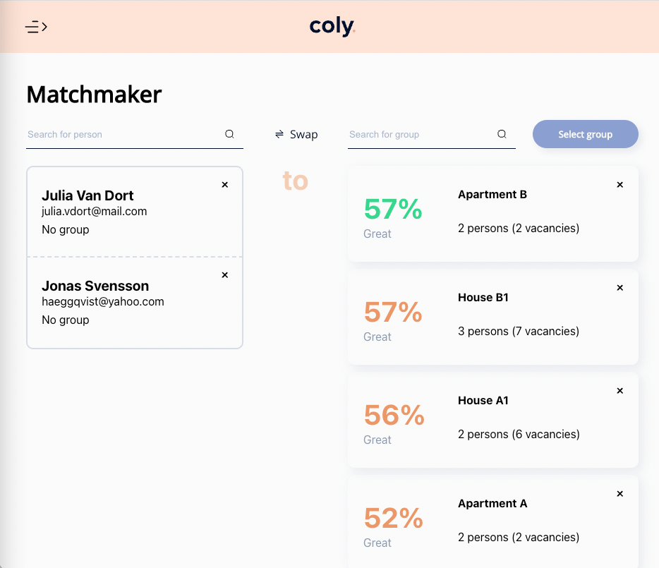
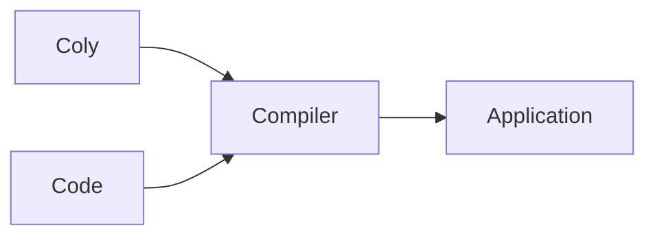

# Coly-Me API

Introduction...



Our amazing app looks like this.

It works like this:



## API

```
GET /something/from/our/rest/api
```


```typescript
const exampleCode = () => "Hello World!"
```


