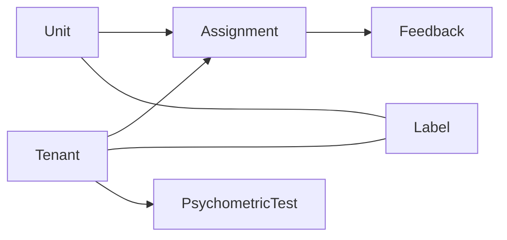
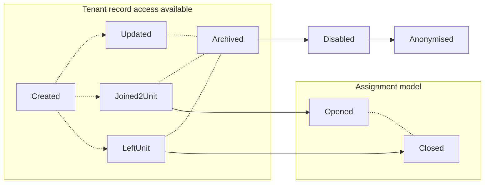

# Coly ME (Match Engine) API documentation
<hr style="background: #4C53FF; height: 5px">

<h6>Version 1.18</h6>


### Table of contents

* [Introduction](#intro_link)
* [Data Lifecycle Description](#description_link)
* [API Endpoints & Auth header](#api_link)
  * [Response structure](#response_structure_link)
  * [Basic query params](#basic_query_params)
  * [Tenants](#api_tenants_link)
    * [Create tenant](#create_tenant_link)
    * [Get tenant information](#get_tenant_link)
    * [Get list of tenants](#get_tenants_list_link)
    * [Update tenant](#update_tenant_link)
    * [Archive tenant](#archive_tenant_link)
    * [Restore tenant from archive](#restore_tenant_link)
    * [Delete tenant from archive](#delete_tenant_link)
    * [Tenant Error Codes](#error_codes_tenant_link)
  * [Notifications (tenant assessment invitation)](#api_notifications_link)
  * [Units](#api_units_link)
    * [Create unit](#create_unit_link)
    * [Get unit information](#get_unit_link)
    * [Get list of units](#get_unit_list_link)
    * [Update unit](#update_unit_link)
    * [Archive unit](#archive_unit_link)
    * [Restore unit from archive](#restore_unit_link)
    * [Delete unit from archive](#delete_unit_link)
    * [Unit Error Codes](#error_codes_unit_link)
  * [Assignments](#api_assignments_link)
    * [Assign tenant to unit](#assign_tenant_unit_link)
    * [Remove tenant from unit](#remove_tenant_unit_link)
    * [Assignment Error Codes](#error_codes_assignments_link)
  * [Matching](#api_match_link)
    * [Match](#match_link)
    * [Best Match](#best_match_link)
    * [Overlap handling](#overlap_handling_link)
    * [Match Error Codes](#error_codes_match_link)
  * [Throttling](#api_throttler_link)
  * [Disclaimer](#disclaimer_link)


## Introduction <a name="intro_link"></a>
<hr style="background: #4C53FF; height: 4px">

The Coly ME API Documentation provides descriptive information for developers who would like to integrate the functionality of the Coly ME API into their solution.

The Coly ME engine is provided in four simple steps. 

1. Create a tenant.
2. Distribute the link to the tenant for the assessment and profile.
3. Create a unit and assign tenants to it.
4. Match.

The API endpoints are documented in the same order as the user flow above.

Go to [API](#api_link) section to get started!


## Data Lifecycle Description<a name="description_link"></a>
<hr style="background: #4C53FF; height: 4px">

Our data models have several types(or layers) that define our approach. Simply speaking, the data lifecycle reveals steps and actions that should be taken to reach them. 



*Diagram1: Visualisation of model dependencies*


### Primary models
<hr style="background: #4C53FF; height: 4px">

Core-level models contain crucial data for system operations.


#### Tenant model
<hr style="background: #FE6958; height: 2px">



- `Created` - Creating an empty tenant record.
- `Updated` - Update client's payload data.
- `Joined2Unit` - Creates new [`Assignment`](#assignment-model) records thus linking [`Tenant`](#tenant-model) and [`Unit`](#unit-model).
- `LeftUnit` - Set's [`Assignment`](#assignment-model) record as inactive
- `Archived` - Changes record access rights, thus making it `read-only`. No updates or any other actions than recovery are available. At the end of the predefined archive record lifetime, it moves to the state `Disabled`
- `Disabled` - Restricts any further public access to data. Life-time defined by coly data retention policy.
- `Anonymised` - Record is being stripped from personal or any sensitive information. Further access is intended solely for the ML training unit.


#### Unit model
<hr style="background: #FE6958; height: 2px">


- `Created` - Creating empty unit record.
- `Updated` - Update client's payload data.
- `TenantJoined` - Creates new [`Assignment`](#assignment-model) record thus linking [`Tenant`](#tenant-model) and [`Unit`](#unit-model).
- `TenantLeft` - Set's [`Assignment`](#assignment-model) record as inactive.
- `Archived` - Changes record access rights, thus making it `read-only`. No updates or any other actions than recovery are available. At the end of the predefined archive record lifetime, it moves to the state `Disabled`.
- `Disabled` - Restricts any further public access to data. Life-time defined by coly data retention policy.
- `Anonymised` - Record is being stripped from personal or any sensitive information. Further access is intended solely for the ML training unit.


## API Endpoints & Auth header<a name="api_link"></a>
<hr style="background: #4C53FF; height: 4px">

Base API URL:


```http
https://me-api.coly.io/v1
```


To connect with our API, you will need to generate an API key. Please follow these steps:

1. Visit your settings page at [Coly Console Settings](https://console.coly.io/settings).
2. Follow the instructions to generate your unique API key.

After obtaining the API key, include it in all requests by setting the Authorization header as follows:

```http
Authorization: Application {yourApiKey}
```

Remember to replace `{yourApiKey}` with your actual API key.

For example:
```http
Authorization: Application TfdZmYRpqVbqaHQoMMWKokbGLQPSvYzgjOhHwtRZJWZTeAObAaDbYzVKpnsjiqmf
```


**API Versioning:**

The current version of our API is indicated by the `v1` prefix in the base URL. This means all endpoints are accessed under this version. Should there be a transition to a new version (e.g., `v2`), we will provide advance notice and ensure backward compatibility, allowing continued access to `v1` endpoints.


### Main Response Structure<a name="response_structure_link"></a>
<hr style="background: #4C53FF; height: 3px">

Our API leverages the Either pattern, a common approach in functional programming, to standardize the structure of all responses. This strategy enables the API to always return a 200 status code, regardless of whether the operation was successful. The outcome of the operation is conveyed in the response's type field, which can be either 'success' or 'failure'.

**Note**: While the following example uses TypeScript, the 'Either' pattern is language-agnostic and can be adapted to your preferred programming language:

```typescript
interface Success<T> {
  type: 'success';
  value: T;
}

interface Failure<E> {
  type: 'failure';
  value: E;
}

type Either<E, T> = Failure<E> | Success<T>;
```


In every response, you'll find the data property structured as one of the following:

```typescript
// Successful response:
{
    "type": "success",
    "value": { ... } // The requested data
}

// Failed response:
{
    "type": "failure",
    "value": { ... } // Error data
}
```


The value of a successfull response will vary across different requests, but all error messages will conform to this structure:

```typescript
interface Error {
	code: FailCode;
	message: string;
}
```


In this format, the message field provides a human-readable explanation primarily for debugging. However, it may change over time, so it should not be relied upon for application logic. On the other hand, the `FailCode` is a unique, constant identifier for a specific type of failure and can be used to handle errors in your application.

Every API endpoint will provide a list of possible FailCodes for each request.


Here are examples of a successful and a failed request:

```http
// Successful request
GET http://localhost:7001/v1/tenants?search=adam
```

```json
// Successful response
{
    "type": "success",
    "value": {
        "total": 1,
        "list": [ { ... } ] // List of data
    }
}
```


```http
// Failed request
GET http://localhost:7001/v1/tenants/abdca582-43d1-4dd8-f652-ad63451a75ad
```

```json
// Failed response
{
    "type": "failure",
    "value": {
        "code": "Tenant::NotFound",
        "message": "Specified tenant record wasn't found."
    }
}
```


One common FailCode for all requests is `InputValidation::Failed`, which signifies an issue with the request body format. Example:

```json
{
    "type": "failure",
    "value": {
        "code": "InputValidation::Failed",
        "message": "[Description of the validation fail]"
    }
}
```


For the remainder of this API documentation, we will describe the structure of the 'value' field and the potential FailCodes for each request.

Although almost all requests return a 200 status code, there are a few exceptions:

- `404`: The requested route doesn't exist.
- `401`: The provided API key is invalid.
- `500`: A system error occurred on our side. This is unintentional and will be addressed promptly. If this happens please get in touch with the team at Coly.


### Basic query params<a name="basic_query_params"></a>
<hr style="background: #4C53FF; height: 4px">

For any of the entities below (`tenant` and `unit`), the following query params are supported when fetching from the backend:

- `pageSize`: The number of records to return per page. This is used for pagination purposes.
- `pageNumber`: The page number to return. This is used in conjunction with `pageSize` for pagination.
- `sortDirection`: The sorting direction, either `asc` for ascending or `desc` for descending.


**Example:**

1. To fetch the first 20 tenants in ascending order by their last name and include their personality traits in the response, use the following query:

```http
GET /tenants?pageSize=20&pageNumber=1&sortDirection=asc
```


### Tenants<a name="api_tenants_link"></a>
<hr style="background: #4C53FF; height: 4px">

The `Tenants` entity mainly refers to the tenants within a shared living space, or tenants taking the `Psychometry Assessment` using our product. Each tenant will have their `personality` and `coreValues` traits calculated after taking the assessment. The score they get will play a key role in matching the individual to a specific unit. 


&nbsp;


#### Create tenant<a name="create_tenant_link"></a>
<hr style="background: #FE6958; height: 2px">

Creates `Tenants` record and returns it. It requires `email` , `firstname`, `lastname` to create a `Tenants` record.

```http
POST /tenants
```


##### Example request body

```json
{
  "email": "james.bond@mymail.com",
  "lastname": "Bond",
  "firstname": "James"
}
```


##### Response example 

```json
{
  "id": "993abaa6-693b-456d-b58b-424057c5f0e3",
  "createdAt": "2022-11-20T17:55:41.266Z",
  "createdBy": "72d6943c-2b64-43bf-8c38-93c83dc4edab",
  "updatedAt": "2022-11-20T17:55:41.266Z",
  "updatedBy": "72d6943c-2b64-43bf-8c38-93c83dc4edab",
  "archivedAt": null,
  "archivedBy": null,
  "firstname": "James",
  "lastname": "Bond",
  "email": "james.bond@mymail.com",
  "gender": null,
  "language": null,
  "country": null,
  "birthDate": null,
  "psychometry": null
}
```


#### Get tenant information<a name="get_tenant_link"></a>
<hr style="background: #FE6958; height: 2px">

Retrieve a single tenant's record with all the detailed pieces of information that you need.


```http
GET /tenants/:id
```


##### Response example

```json
{
  "id": "11131f6e-5654-4d72-bff0-b4d60b1c9b3a",
  "createdAt": "2022-10-19T19:37:03.602Z",
  "createdBy": "72d6943c-2b64-43bf-8c38-93c83dc4edab",
  "updatedAt": "2022-10-19T19:37:03.602Z",
  "updatedBy": "72d6943c-2b64-43bf-8c38-93c83dc4edab",
  "archivedAt": null,
  "archivedBy": null,
  "firstname": "Lucy",
  "lastname": "Carlson",
  "email": "lucy.carlson@mymail.com",
  "gender": null,
  "language": null,
  "country": null,
  "birthDate": null,
  "psychometry": {
    "traits": {
      "personality": {
        "emotionalStability": 100,
        "conscientiousness": 100,
        "agreeableness": 100,
        "extroversion": 100,
        "openness": 100
      },
      "coreValues": {
        "selfDirection": 68.1000781861,
        "universalism": 25.6450351837,
        "achievement": 90.2267396403,
        "benevolence": 38.7802971071,
        "conformity": 67.4745895231,
        "tradition": 88.8975762314,
        "security": 88.4284597342,
        "hedonism": 64.7380766224,
        "activity": 63.6434714621,
        "power": 93.6669272869
      }
    },
    "submittedAt": "2022-10-19T19:47:03.891Z",
  },
  "assignment": {
    "assignedAt": "2024-01-22T11:26:29.217Z",
    "assignedBy": "b2555444-5071-7005-4e38-fe7a4f084987",
    "moveInAt": "2024-01-22T00:00:00.000Z",
    "unit": {
      "id": "ea5d0c05-c43f-408c-a650-288e3674c35c",
      "createdAt": "2024-01-22T11:26:21.716Z",
      "createdBy": "b2555444-5071-7005-4e38-fe7a4f084987",
      "updatedAt": "2024-01-22T11:26:29.224Z",
      "updatedBy": "b2555444-5071-7005-4e38-fe7a4f084987",
      "archivedAt": null,
      "archivedBy": null,
      "title": "Spruce St 66",
      "capacity": 4,
      "members": 1,
      "status": "Vacant"
    }
  }
}
```


#### Get list of tenants<a name="get_tenants_list_link"></a>
<hr style="background: #FE6958; height: 2px">

Retrieves the list of tenant's records, with the total number of `Tenants` and their detailed pieces of information.


```http
GET /tenants
```


##### Response example

```json
{
  "total": 1,
  "list": [
    {
      "id": "11131f6e-5654-4d72-bff0-b4d60b1c9b3a",
      "createdAt": "2022-10-19T19:37:03.602Z",
      "createdBy": "72d6943c-2b64-43bf-8c38-93c83dc4edab",
      "updatedAt": "2022-10-19T19:37:03.602Z",
      "updatedBy": "72d6943c-2b64-43bf-8c38-93c83dc4edab",
      "archivedAt": null,
      "archivedBy": null,
      "firstname": "John",
      "lastname": "Doe",
      "email": "john.doe@coly.io",
      "gender": null,
      "language": null,
      "country": null,
      "birthDate": null,
      "psychometry": {
        "traits": {
          "personality": {
            "emotionalStability": 100,
            "conscientiousness": 100,
            "agreeableness": 100,
            "extroversion": 100,
            "openness": 100
          },
          "coreValues": {
            "selfDirection": 68.1000781861,
            "universalism": 25.6450351837,
            "achievement": 90.2267396403,
            "benevolence": 38.7802971071,
            "conformity": 67.4745895231,
            "tradition": 88.8975762314,
            "security": 88.4284597342,
            "hedonism": 64.7380766224,
            "activity": 63.6434714621,
            "power": 93.6669272869
          }
        },
        "submittedAt": "2022-10-19T19:47:03.891Z",
      }
    }
  ],
  "isDone": false
}
```


##### Available query options for tenant relations:

* include units in tenants with the following query param

  ```http
  GET /tenants?relations[]=unit
  ```


#### Update tenant<a name="update_tenant_link"></a>
<hr style="background: #FE6958; height: 2px">

* Updates `Tenants` record fields and returns updated tenant record.
* Resends email invitation if pending `Psychometric Assessment` exists.

```http
PUT /tenants/:id
```


##### Example request body

```json
{
  "email": "james.dean@mymail.com",
  "lastname": "Dean",
  "firstname": "James"
}
```


##### Response example : Changed tenant name

```json
{
  "id": "993abaa6-693b-456d-b58b-424057c5f0e3",
  "createdAt": "2022-11-20T17:55:41.266Z",
  "createdBy": "72d6943c-2b64-43bf-8c38-93c83dc4edab",
  "updatedAt": "2022-11-20T17:55:41.266Z",
  "updatedBy": "72d6943c-2b64-43bf-8c38-93c83dc4edab",
  "archivedAt": null,
  "archivedBy": null,
  "firstname": "James",
  "lastname": "Dean",
  "email": "james.dean@mymail.com",
  "gender": null,
  "language": null,
  "country": null,
  "birthDate": null,
  "psychometry": null
}
```


#### Archive tenant<a name="archive_tenant_link"></a>
<hr style="background: #FE6958; height: 2px">

Archive `Tenants` record status.

```http
PATCH /tenants/:id/archive
```


##### Response example : Archive tenant

```json
{
  "id": "993abaa6-693b-456d-b58b-424057c5f0e3",
  "createdAt": "2022-11-20T17:55:41.266Z",
  "createdBy": "72d6943c-2b64-43bf-8c38-93c83dc4edab",
  "updatedAt": "2022-11-20T17:55:41.266Z",
  "updatedBy": "72d6943c-2b64-43bf-8c38-93c83dc4edab",
  "archivedAt": "2022-11-20T18:10:01.449Z",
  "archivedBy": "72d6943c-2b64-43bf-8c38-93c83dc4edab",
  "firstname": "James",
  "lastname": "Dean",
  "email": "james.dean@mymail.com",
  "gender": null,
  "language": null,
  "country": null,
  "birthDate": null,
  "psychometry": {
    "traits": {
      "personality": {
        "emotionalStability": 10.7896794371,
        "conscientiousness": 2.7365129007,
        "agreeableness": 0.5473025801,
        "extroversion": 11.6497263487,
        "openness": 9.3041438624
      },
      "coreValues": {
        "selfDirection": 11.493354183,
        "universalism": 0.7036747459,
        "achievement": 41.2822517592,
        "benevolence": 1.0946051603,
        "conformity": 2.1892103206,
        "tradition": 47.3025801407,
        "security": 10.6333072713,
        "hedonism": 1.8764659891,
        "activity": 1.4073494918,
        "power": 7.662236122
      }
    },
    "submittedAt": "2023-05-19T11:34:04.535Z",
  }
}
```


#### Restore tenant from archive<a name="restore_tenant_link"></a>
<hr style="background: #FE6958; height: 2px">

Restores a `Tenants` record from the archive.

```http
PATCH /tenants/:id/restore
```


##### Response example : Restore the achived tenant

```json
{
  "id": "993abaa6-693b-456d-b58b-424057c5f0e3",
  "createdAt": "2022-11-20T17:55:41.266Z",
  "createdBy": "72d6943c-2b64-43bf-8c38-93c83dc4edab",
  "updatedAt": "2022-11-20T17:55:41.266Z",
  "updatedBy": "72d6943c-2b64-43bf-8c38-93c83dc4edab",
  "archivedAt": null,
  "archivedBy": null,
  "firstname": "James",
  "lastname": "Dean",
  "email": "james.dean@mymail.com",
  "gender": null,
  "language": null,
  "country": null,
  "birthDate": null,
  "psychometry": null
}
```


#### Delete tenant from archive<a name="delete_tenant_link"></a>
<hr style="background: #FE6958; height: 2px">

Disabling and deleting `Tenants` record from archived.

```http
DELETE /tenants/:id
```

*Note that only the archived records can be deleted.*


#### Tenant Error Codes <a name="error_codes_tenant_link"></a>
<hr style="background: #FE6958; height: 2px">
Here are the possible error codes for a failure response in the tenants route.

##### Record Not Found

When the desired record is missing:

```json
Tenant::NotFound
```


##### Email Already In Use

When creating a `Tenant` record, the user's email should be unique and not be reused unless the tenant has been removed from the platform:

```json
Tenant::EmailUsed
```


##### Archived Record Restriction

For archived records, they are not allowed to be matched, or assigned to units. To achieve this, you would need to restore the record first:

```json
Tenant::ArchiveStatusRestriction
```


For non-archived records, you would have to archive the record first to disable/delete it:

```json
Tenant::ArchiveStatusRequired
```


##### Unknown

If there is a case of an unknown `Error`, there is a high chance of server-side error. Contact us through our email [dev@coly.io](mailto:dev@coly.io) with detailed information about the error:

```json
Tenant::Unknown
```


 

### Notifications<a name="api_notifications_link"></a>
<hr style="background: #4C53FF; height: 4px">

To initiate the assessment process for a tenant, use the endpoint below. This action triggers an automated email sequence to encourage the tenant to complete their psychometric assessment. The sequence includes an initial invitation followed by reminders if the assessment isn't completed within specific intervals.

```http
POST /notifications/invite/tenant
```


**Behavior:**

Upon invoking this endpoint, an email is dispatched to the specified tenant, marking the commencement of a notification chain. If the tenant does not complete the assessment within 3 days, they receive a follow-up reminder. A final reminder is sent if the assessment remains incomplete 5 days after the initial email. Triggering this endpoint for a tenant will reset any existing reminder sequences for them, starting the process anew.


##### Example request body

```json
{
  "tenantId": "5a7cc372-8d04-4d33-8186-41416ebd41e5",
}
```

A successful request returns `{"type": "success"}`, indicating the email sequence has been initiated. If the tenant cannot be found, the response will be `{"type": "failure"}`, accompanied by a failcode of `Tenant::NotFound`.


### Units<a name="api_units_link"></a>
<hr style="background: #4C53FF; height: 4px">

The `Units` entity is a collection of `Tenants`. Usually refers to a unit of `Tenants` who live in a shared living space. A unit is created by `title` and `capacity`. A unit with tenants contains a calculated average score of the `personality` and `coreValues`, scale that can be used to match an incoming tenant. 


#### Create unit<a name="create_unit_link"></a>
<hr style="background: #FE6958; height: 2px">

Creates `Unit` record and returns it. It requires a Unit `name` and a `capacity` of tenants for the unit.

```http
POST /units
```


##### Example request body

```json
{
  "title": "Apartment A",
  "capacity": 4,
}
```


##### Response example

```json
{
  "id": "8291747b-f415-4854-95ff-40c43919201c",
  "createdAt": "2022-11-17T21:13:37.601Z",
  "createdBy": "72d6943c-2b64-43bf-8c38-93c83dc4edab",
  "updatedAt": "2022-11-17T21:13:37.601Z",
  "updatedBy": "72d6943c-2b64-43bf-8c38-93c83dc4edab",
  "archivedAt": null,
  "archivedBy": null,
  "title": "Apartment A",
  "capacity": 4,
  "psychometry": null
}
```


#### Get unit information<a name="get_unit_link"></a>
<hr style="background: #FE6958; height: 2px">

Retrieve a single `Unit` record with all the detailed pieces of information that you need, including `personality` and `coreValues` percentile.

```http
GET /units/:id
```


##### Response example 1

```json
{
  "id": "c35321c0-a788-46f4-8e8a-b11007915275",
  "createdAt": "2023-05-29T16:32:59.828Z",
  "createdBy": "f892369b-1cab-4d8c-b24f-4603010975b9",
  "updatedAt": "2023-05-29T16:32:59.828Z",
  "updatedBy": "f892369b-1cab-4d8c-b24f-4603010975b9",
  "archivedAt": null,
  "archivedBy": null,
  "title": "Highfield Avenue",
  "capacity": 6,
  "members": 4,
  "status": "Vacant",
  "psychometry": {
    "completeness": 1,
    "traits": {
      "personality": {
        "emotionalStability": 18.7255668491,
        "conscientiousness": 8.3072713057,
        "agreeableness": 4.339327599675,
        "extroversion": 7.46677091475,
        "openness": 7.54495699765
      },
      "coreValues": {
        "selfDirection": 13.623924941350001,
        "universalism": 3.479280688,
        "achievement": 5.531665363575,
        "benevolence": 5.668491008599999,
        "conformity": 15.519937451099999,
        "tradition": 29.6520719312,
        "security": 6.2744331509,
        "hedonism": 18.706020328374997,
        "activity": 16.849100860075,
        "power": 17.386630179824998
      }
    }
  }
}
```


**Response Example 2**:

```http
GET /units/c35321c0-a788-46f4-8e8a-b11007915275?relations[]=tenants
```

```json
{
  "id": "c35321c0-a788-46f4-8e8a-b11007915275",
  "createdAt": "2023-05-29T16:32:59.828Z",
  "createdBy": "f892369b-1cab-4d8c-b24f-4603010975b9",
  "updatedAt": "2023-05-29T16:32:59.828Z",
  "updatedBy": "f892369b-1cab-4d8c-b24f-4603010975b9",
  "archivedAt": null,
  "archivedBy": null,
  "title": "Highfield Avenue",
  "image": null,
  "capacity": 6,
  "members": 2,
  "status": "Vacant",
  "psychometry": {
    "updatedAt": "2023-05-30T18:51:43.460Z",
    "traits": {
      "personality": {
        "emotionalStability": 18.7255668491,
        "conscientiousness": 8.3072713057,
        "agreeableness": 4.339327599675,
        "extroversion": 7.46677091475,
        "openness": 7.54495699765
      },
      "coreValues": {
        "selfDirection": 13.623924941350001,
        "universalism": 3.479280688,
        "achievement": 5.531665363575,
        "benevolence": 5.668491008599999,
        "conformity": 15.519937451099999,
        "tradition": 29.6520719312,
        "security": 6.2744331509,
        "hedonism": 18.706020328374997,
        "activity": 16.849100860075,
        "power": 17.386630179824998
      }
    }
  },
  "assignments": [
    {
      "assignedAt": "2023-05-29T16:33:01.043Z",
      "assignedBy": "f892369b-1cab-4d8c-b24f-4603010975b9",
      "moveInAt": "2023-05-31T16:33:01.043Z",
      "tenant": {
        "id": "7dc424e6-f29f-4043-b2ce-41bddebad81a",
        "createdAt": "2023-04-12T16:33:01.043Z",
        "createdBy": "f892369b-1cab-4d8c-b24f-4603010975b9",
        "updatedAt": "2023-10-12T16:33:01.043Z",
        "updatedBy": "f892369b-1cab-4d8c-b24f-4603010975b9",
        "archivedAt": null,
        "archivedBy": null,
        "firstname": "Kristine",
        "lastname": "Hess"
        // ... etc
      }
    },
    {
      "assignedAt": "2023-06-02T16:33:01.043Z",
      "assignedBy": "f892369b-1cab-4d8c-b24f-4603010975b9",
      "moveInAt": "2023-06-05T16:33:01.043Z",
      "tenant": {
        "id": "03bb42d4-e9f3-43e7-9dd3-777434f7d1a5",
        "createdAt": "2023-05-20T12:29:01.043Z",
        "createdBy": "f892369b-1cab-4d8c-b24f-4603010975b9",
        "updatedAt": "2023-07-20T12:29:01.043Z",
        "updatedBy": "f892369b-1cab-4d8c-b24f-4603010975b9",
        "archivedAt": null,
        "archivedBy": null,
        "firstname": "Susannah",
        "lastname": "Nesbitt"
        // ... etc
      }
    }
  ]
}
```


#### Get list of units<a name="get_unit_list_link"></a>
<hr style="background: #FE6958; height: 2px">

Retrieves a list of `Units` records, with the total number of units and detailed information about each unit.

```http
GET /units
```


##### Response example:

```json
{
  "total": 1,
  "list": [
    {
      "id": "3747a4ab-a385-4215-9084-5c1479019ba6",
      "createdAt": "2022-10-31T15:24:51.730Z",
      "createdBy": "72d6943c-2b64-43bf-8c38-93c83dc4edab",
      "updatedAt": "2022-11-01T16:01:03.485Z",
      "updatedBy": "72d6943c-2b64-43bf-8c38-93c83dc4edab",
      "archivedAt": null,
      "archivedBy": null,
      "title": "Apartment A",
      "capacity": 4,
      "psychometry": {
        "updatedAt": "2022-11-01T09:57:01.269Z",
        "traits": {
          "personality": {
          "emotionalStability": 0,
          "conscientiousness": 27.16966379985,
          "agreeableness": 2.6192337764,
          "extroversion": 85.3010164191,
          "openness": 30.6880375293
          },
          "coreValues": {
            "selfDirection": 14.425332290850001,
            "universalism": 15.324472243899999,
            "achievement": 75.29319781075,
            "benevolence": 20.60203283815,
            "conformity": 36.2392494136,
            "tradition": 46.1884284597,
            "security": 45.19155590305,
            "hedonism": 44.05785770135,
            "activity": 63.6434714621,
            "power": 93.6669272869
          }
        }
      }
    }
  ],
  "isDone": true
}
```


##### Available query options for unit statuses:

* Units that are empty.

  ```http
  GET /units?status=empty
  ```

* Units that are **not** empty:

  ````http
  GET /units?status=!empty
  ````

* Units with **all** stats and those who has vacancies:

  ```http
  GET /units?status[]=full&status[]=vacant
  ```

* Units with **all** stats but excluding `vacant`:

  ```http
  GET /units?status[]=full&status[]=!vacant
  ```

  

  **NOTE**: By design in query options `exclusive "!*"` flags are **prioritized**, for example:
  
  in the case above we first select all statuses except `vacant` because the order doesn’t matter. And then we go along `inclusive` or normal flags to include desired. So that the result of the last query is the following: “units with all statuses excluding `vacant` but including `full`”. You can also exclude several. Duplications would be ignored.
  


##### Available query options for unit relations:

* include tenants in units with the following query param

  ```http
  GET /units?relations[]=tenants
  ```


#### Update unit<a name="update_unit_link"></a>
<hr style="background: #FE6958; height: 2px">

Updates `Unit` record fields and returns it updated. You can alter the `name` and the `capacity` of the unit record you created.

```http
PUT /units/:id
```


##### Example request body

```json
{
  "title": "Apartment A1",
  "capacity": 2,
}
```


##### Response example : Changed unit capacity

```json
{
  "id": "8291747b-f415-4854-95ff-40c43919201c",
  "createdAt": "2022-11-17T21:13:37.601Z",
  "createdBy": "72d6943c-2b64-43bf-8c38-93c83dc4edab",
  "updatedAt": "2022-11-17T21:13:37.601Z",
  "updatedBy": "72d6943c-2b64-43bf-8c38-93c83dc4edab",
  "archivedAt": null,
  "archivedBy": null,
  "title": "Apartment A1",
  "capacity": 2,
  "psychometry": null
}
```


#### Archive unit<a name="archive_unit_link"></a>
<hr style="background: #FE6958; height: 2px">

Archive `Unit` record status.

```http
PATCH /units/:id/archive
```


##### Response example : Archive unit

```json
{
  "id": "8291747b-f415-4854-95ff-40c43919201c",
  "createdAt": "2022-11-17T21:13:37.601Z",
  "createdBy": "72d6943c-2b64-43bf-8c38-93c83dc4edab",
  "updatedAt": "2022-11-17T22:40:37.575Z",
  "updatedBy": "72d6943c-2b64-43bf-8c38-93c83dc4edab",
  "archivedAt": "2022-11-17T22:42:26.613Z",
  "archivedBy": "72d6943c-2b64-43bf-8c38-93c83dc4edab",
  "title": "Apartment A1",
  "capacity": 2,
  "psychometry": null
}
```


#### Restore unit from archive<a name="restore_unit_link"></a>
<hr style="background: #FE6958; height: 2px">

Restores a `Unit` record from the archive.

```http
PATCH /units/:id/restore
```


##### Response example : Restore the archived unit

```json
{
  "id": "8291747b-f415-4854-95ff-40c43919201c",
  "createdAt": "2022-11-17T21:13:37.601Z",
  "createdBy": "72d6943c-2b64-43bf-8c38-93c83dc4edab",
  "updatedAt": "2022-11-17T22:40:37.575Z",
  "updatedBy": "72d6943c-2b64-43bf-8c38-93c83dc4edab",
  "archivedAt": null,
  "archivedBy": null,
  "title": "Apartment A1",
  "capacity": 2,
  "psychometry": null
}
```


#### Delete unit from archive<a name="delete_unit_link"></a>
<hr style="background: #FE6958; height: 2px">

Disabling and deleting `Unit` record from archived.

```http
DELETE /units/:id
```

*Note that only the archived records can be deleted.*


##### Response example: Unit record deleted

```http
Status: 204 No content
```


#### Unit Error Codes <a name="error_codes_unit_link"></a>
<hr style="background: #FE6958; height: 2px">

##### Record Not Found

When the desired record is missing:

```json
Unit::NotFound
```


##### Unit Name Already In Use

When creating a `Unit` record, the unit's name should be unique. This includes the archived units as well:

```json
Unit::TitleUsed
```


##### Archived Record Restrictions

For archived records, you'll need restore them before they can be used again:

```json
Unit::ArchiveStatusRestriction
```


For non-archived records, you would have to archive the record first to disable/delete it:

```json
Unit:ArchiveStatusRequired
```


##### Not Empty

In case there's an operation such as archive on a non-empty unit record:

```json
Unit::NotEmpty
```


##### Unknown

If there is a case of an unknown Error, there is a high chance of server-side error. Contact us through email at [dev@coly.io](mailto:dev@coly.io) with detailed information about the error:

```json
Unit::Unknown
```


### Assignments<a name="api_assignments_link"></a>
<hr style="background: #4C53FF; height: 4px">

`Assignments` are used for adding and removing `Tenants` to and from a `Unit`. Assignments are indicating the relation between `Tenants` and `Units` records. 


#### Assign tenant to unit<a name="assign_tenant_unit_link"></a>
<hr style="background: #FE6958; height: 2px">

Assign a `Tenant`  to a `Unit`. You would need both `unitId` and `tenantId` to create assignment records.

```http
POST /assignments
```


##### Example request body

```json
{
  "unitId": "3747a4ab-a385-4215-9084-5c1479019ba6",
  "tenantId": "11131f6e-5654-4d72-bff0-b4d60b1c9b3a"
}
```


##### Response example

The response will be an empty response, with the either pattern indicating success or failure. For example:

```json
{
  "type": "success",
}
```


#### Remove tenant from unit<a name="remove_tenant_unit_link"></a>
<hr style="background: #FE6958; height: 2px">

Remove a `Tenant` from a `Unit`. This closes the assignment for specified tenant by deleting or removing the assignment record. 

```http
DELETE /assignments
```


##### Example request body

```json
{
  "tenantId": "11131f6e-5654-4d72-bff0-b4d60b1c9b3a"
}
```


##### Response example

Same philosophy as in the POST /assignments endpoint. For example:

```json
{
  "type": "success",
}
```


#### Assignment Error Codes <a name="error_codes_assignments_link"></a>
<hr style="background: #FE6958; height: 2px">

##### Unit Overflow

When no vacancies are left for the `unit`, attempting to assign new `tenant` records will not be possible:

```json
Unit::Overflow
```


##### Assigned Tenant Record Restriction

Tenant records are only allowed to be assigned to one unit at a time. In case of attempting to assign to multiple units:

```json
Tenant::UnitRestriction
```


**Other error codes**

These errors can also occure when attempting to assign records. Note that these are described in the tenant and unit routes above:

```
Tenant::ArchiveStatusRestriction
```

```
Tenant::NotFound
```

```
Unit::ArchiveStatusRestriction
```

```
Unit::NotFound
```


### Matching<a name="api_match_link"></a>
<hr style="background: #4C53FF; height: 4px">

The Matching Engine provides a method for evaluating the compatibility between individuals and units within our system. Compatibility is quantified using a score ranging from 0 to 100. Detailed below are two endpoints:

1. Match - This facilitates matching between a chosen source and target.

2. Best Match - This fetches the most compatible units or individuals for a given source.


#### Match <a name="match_link"></a>
<hr style="background: #FE6958; height: 2px">

The `Match` function compares a single `source` to multiple `targets`,  and generates an array of scores to indicate the level of compatibility between each source and target. `source` can be a single tenant, single unit, or a an array of tenants (what we usually refer to as "virtual unit"). `targets` can be an array with combinations of units, tenants, or also a virtual units.

The response includes an object with a `results` field, which contains an array representing the compatibility of each match. The scores are indexed in the same order as the targets array in the request.

* Request fields:
  - `source`: Represents the single matching source.
  - `targets`: Represents the array of matching targets.
  - `type`: Indicates the type of entity being matched, with `tenant` for a `Tenant`, `unit` for a `Unit`, and `virtualUnit` for an object containing a list of tenants.
  - `id`: Represents the ID of the entity.
* Response fields:
  - `results`: Contains an array of matching results, provided in the same order as the request.
  - `type`: Indicates whether the matching was successful or not, with possible values of `resolved` and `rejected`.
  - For `type: resolved`:
    - `score`: A decimal number between 0 and 100, indicating the compatibility of the matches.
    - `type`: Will have the value "resolved".
  - For `type: rejected`:
    - `message`: Provides information about why the matching result could not be calculated.
    - `code`: Contains the rejection code specific to the reason for the matching rejection.
    - `type`: Will have the value "rejected".


```http
POST /match
```


##### Example request body

```json
{
  "source": {
    "type": "tenant",
    "id": "a601daf0-fe21-4b02-9659-21c426e9b7a4"
  },
  "targets": [
    {
      "type": "unit",
      "id": "3747a4ab-a385-4215-9084-5c1479019ba6"
    },
    {
      "type": "unit",
      "id": "5295a4ab-b456-9385-1056-4a1857492cd7"
    }
  ]
}
```


##### Response example: Returns matching score

```json
{
    "results": [
        {
            "score": 77.92,
            "type": "resolved"
        },
        {
            "score": 86.24,
            "type": "resolved"
        }
    ],
}
```


##### Example 2 request body (source is an array of tenants, i.e, "virtual unit")

```json
{
  "source": {
    "type": "virtualUnit",
    "list": [
      {
        "type": "tenant",
        "id": "a601daf0-fe21-4b02-9659-21c426e9b7a4"
      },
      {
        "type": "tenant",
        "id": "1d27c0ab-9c7b-4738-a2fd-0ca013c4de10"
      }
    ]
  },
  "targets": [
    {
      "type": "unit",
      "id": "3747a4ab-a385-4215-9084-5c1479019ba6"
    },
    {
      "type": "unit",
      "id": "5295a4ab-b456-9385-1056-4a1857492cd7"
    }
  ]
}
```


##### Response 2 example: Returns matching score

```json
{
    "results": [
        {
            "score": 59.57382039583729,
            "type": "resolved"
        },
        {
            "score": 71.64483092758392,
            "type": "resolved"
        }
    ],
}
```


##### Example 3 request body (targets now also includes a virtual unit, and a tenant)

```json
{
  "source": [
    {
      "type": "tenant",
      "id": "a601daf0-fe21-4b02-9659-21c426e9b7a4"
    },
    {
      "type": "tenant",
      "id": "1d27c0ab-9c7b-4738-a2fd-0ca013c4de10"
    }
  ],
  "targets": [
    {
      "type": "unit",
      "id": "3747a4ab-a385-4215-9084-5c1479019ba6"
    },
    {
      "type": "tenant",
      "id": "5295a4ab-b456-9385-1056-4a1857492cd7"
    },
    {
      "type": "virtualUnit",
      "list": [
        {
          "type": "tenant",
          "id": "4df377f2-d6b0-4540-95f7-3fbc949d0015"
        },
        {
          "type": "tenant",
          "id": "6213111e-741b-43b1-a178-13ab09f62c30"
        }
      ]
    }
  ]
}
```


##### Response 3 example: Returns matching score

```json
{
  "results": [
    {
      "score": 59.57382039583729,
      "type": "resolved"
    },
    {
      "score": 71.64483092758392,
      "type": "resolved"
    },
    {
      "score": 83.83191093758392,
      "type": "resolved"
    }
  ]
}
```


**Example request 4: The second unit happens to be empty**

```json
{
  "source": {
    "type": "tenant",
    "id": "b601daf0-fe21-4b02-9659-21c426e9b7c7"
  },
  "targets": [
    {
      "type": "unit",
      "id": "1377a4ab-a385-4215-9084-5c1479019ba6"
    },
    {
      "type": "unit",
      "id": "7201a4ab-b456-9385-1056-4a1857492vg7"
    }
  ]
}
```


**Example response 4: The response in case of a rejection** 

```json
{
  "results": [
    {
      "score": 82.92,
      "type": "resolved"
    },
    {
      "type": "rejected",
      "message": "There should be no empty source/target. Repeating tenants are ignored.",
      "code": "EmptyUnit"
    }
  ]
}
```


#### Best Match <a name="best_match_link"></a>
<hr style="background: #FE6958; height: 2px">

The best match endpoint enables you to locate the best matching entity across the entire workspace for a specified source.

* Request fields:
  - `source`: Specifies the single source for matching.
    - `type`: Type of entity being matched, `tenant` for a `Tenant`, `unit` for a `Unit`, and `virtualUnit` for an object containing a list of tenants (This `source` field is identical to the one in the `/match` endpoint)
    - `id`: Represents the ID of the entity.
  - `targetType`: This field specifies the type of entity you want to be included in your best match results. It can be either `tenant` or `unit`.
* Response fields:
  - `results`: This field contains an array of match results, presented in descending order from the best match first.
  - `type`: Indicates the entity type, `unit` or `tenant`. 
  - `entity`: This field pertains to the entity of the matched item, which can be either a unit or a tenant, as dictated by the type. For the schema of Unit and Tenant entities, refer to the preceding sections.
  - `score`: The match score.
  

As you may have noted, there are no differences between `resolved` or `rejected` requests - best match will exclusively contain resolved matches. At most, 20 items will be included, but this may be fewer if the system currently lacks a sufficient number of individuals or units available for matching.

```http
POST /match/best
```


##### Example request body

```json
{
  "source": { "type": "tenant", "id": "d805cf84-1237-4ffd-bbda-f5d66b09ce72" },
  "targetType": "unit"
}
```


##### Response example: Returns best matching score for tenant to units

```json
{
  "results": [
    {
      "type": "unit",
      "entity": {
        "id": "ce602e65-1c11-4b53-9d68-d4911c5ec4eb",
        "createdAt": "2023-05-19T11:33:58.759Z",
        "createdBy": "f892369b-1cab-4d8c-b24f-4603010975b9",
        "title": "Apple Acre",
        "status": "Vacant",
        // ... etc

      },
      "score": 95.02
    },
    {
      "type": "unit",
      "entity": {
        "id": "02982527-c090-4024-af39-a565b641c466",
        "createdAt": "2023-05-19T11:33:58.827Z",
        "createdBy": "f892369b-1cab-4d8c-b24f-4603010975b9",
        // ... etc
      },
      "score": 94.63
    },
    // ... etc
  ]
}
```


#### Overlap handling<a name="overlap_handling_link"></a>
<hr style="background: #FE6958; height: 2px">

Overlap handling is implemented for all matching requests. It takes into account situations where some individuals appearing in the source also exist in the target entities. This may happen, for example, when matching an individual with a unit in which they are already a member. The default procedure for managing such scenarios involves the following steps:

* If the source contains only one tenant: Any individual with the same ID in the target list is removed before calculating the match result.
* If the target consists of a single entity: Any individual with the same ID in the source list is removed before calculating the match result.
* If both the source and the target include more than one tenant: Any individuals in the target list who also appear in the source are removed before calculating the match result.
* If the overlap handling process results in either the source or the target becoming empty, the matching request will be rejected.

By applying these rules, the overlap handling ensures that the same tenant doesn't feature in both the source and target when a match is being calculated, thus maintaining the integrity of the matching process.


#### Match Error Codes <a name="error_codes_match_link"></a>
<hr style="background: #FE6958; height: 2px">
The error codes possible to get from the match endpoint are:

```
Tenant::NotFound
```

```
Unit::NotFound
```

These are described in the tenant and unit routes.


### Throttling<a name="api_throttler_link"></a>
<hr style="background: #4C53FF; height: 4px">

In the context of the API, there's a throttler mechanism that enforces rate limits on the number of requests a client can make to ensure that the API remains responsive and available for all clients and to prevent one client from monopolizing the resources of the API.


When a client exceeds the rate limit, the API will return a 429 error to indicate that the client has exceeded its allowed number of requests. The client should wait a certain amount of time before retrying the request. The duration of the waiting time is included in the response headers in the form of the 'Retry-After' header.

```
A 429 error, also known as a "Too Many Requests" error, is an HTTP status code that indicates that the user has sent too many requests in a given amount of time. This type of error is typically used to prevent a client from overwhelming a server with too many requests in a short period of time.
```


### Disclaimer<a name="disclaimer_link"></a>
<hr style="background: #4C53FF; height: 4px">

Please note that any data found on an object that is not explicitly mentioned in this document is not officially supported. Such values are susceptible to alterations at any time without prior notice.
