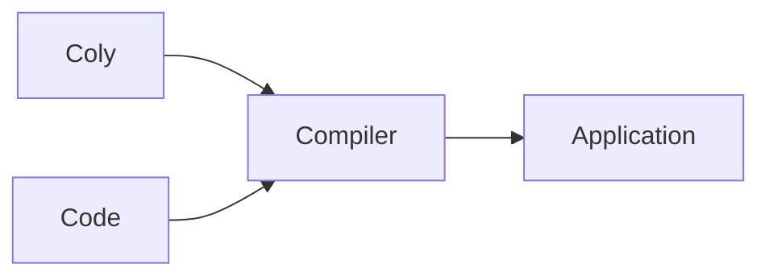

# Coly-Me API

Table of contents:

* [Introduction](#intro_link)
* [Description](#description_link)
* [API](#api_link)

---

#### Introduction...<a name="intro_link"></a>


Our amazing app looks like this.


#### Description<a name="description_link"></a>

It works like this:



## API<a name="api_link"></a>

```
GET /something/from/our/rest/api
```

```
POST /something/to/our/rest/api
```


```typescript
const exampleCode = () => "Hello World!"
```


