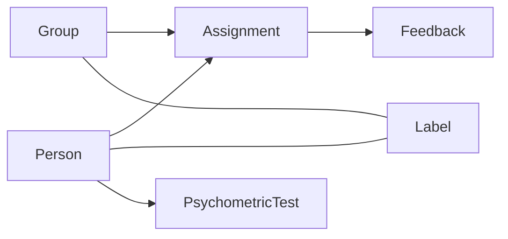
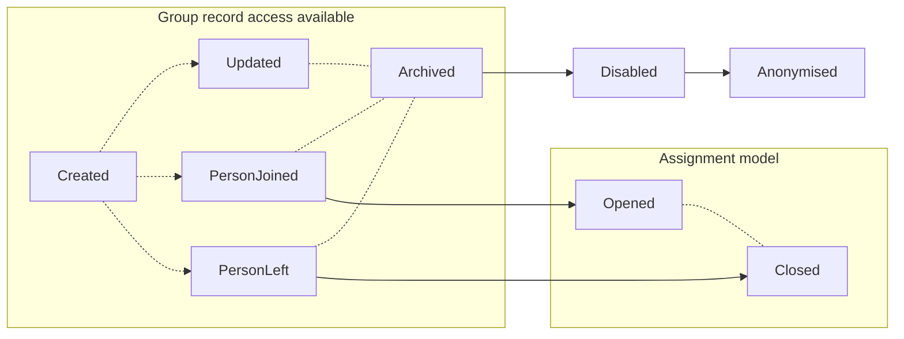

# Coly ME (Match Engine) API documentation
<hr style="background: #4C53FF; height: 5px">

<h6>Version 1.0</h6>


### Table of contents

* [Introduction](#intro_link)
* [Data Lifecycle Description](#description_link)
* [API Endpoints](#api_link)
  * [Response structure](#api_authentication_link)
  * [Authentication](#api_authentication_link)
    * [Authentication Exceptions & Error Handling](#exceptions_auth_link) 
  * [Basic query params](#basic_query_params)
  * [Persons](#api_persons_link)
    * [Create person](#create_person_link)
    * [Get person information](#get_person_link)
    * [Get a person unique assessment & profile link](#get_person_assessment_link)
    * [Get list of persons](#get_persons_list_link)
    * [Update person](#update_person_link)
    * [Person assessment invitation](#Person_invite_link)
    * [Archive person](#archive_person_link)
    * [Restore person from archive](#restore_person_link)
    * [Delete person from archive](#delete_person_link)
    * [Person Exceptions & Error Handeling](#exceptions_person_link)
  * [Groups](#api_groups_link)
    * [Create group](#create_group_link)
    * [Get group information](#get_group_link)
    * [Get list of groups](#get_group_list_link)
    * [Update group](#update_group_link)
    * [Archive group](#archive_group_link)
    * [Restore group from archive](#restore_group_link)
    * [Delete group from archive](#delete_group_link)
    * [Group Exceptions & Error Handeling](#exceptions_group_link)
  * [Assignments](#api_assignments_link)
    * [Assign person to group](#assign_person_group_link)
    * [Remove person from group](#remove_person_group_link)
    * [Assignment Exceptions & Error Handling](#exceptions_assignments_link)
  * [Matching](#api_match_link)
    * [Match](#match_link)
    * [Best Match](#best_match_link)
    * [Overlap handling](#overlap_handling_link)
  * [Throttling](#api_throttler_link)
  * [Disclaimer](#disclaimer_link)


## Introduction <a name="intro_link"></a>
<hr style="background: #4C53FF; height: 4px">

The Coly ME API Documentation provides descriptive information for developers who would like to integrate the functionality of the Coly ME API into their solution.

The Coly ME engine is provided in four simple steps. 

1. Create a person.
2. Distribute the link to the person for the assessment and profile.
3. Create a group and assign persons to it.
4. Match.

The API endpoints are documented in the same order as the user flow above.

Go to [API](#api_link) section to get started!


## Data Lifecycle Description<a name="description_link"></a>
<hr style="background: #4C53FF; height: 4px">

Our data models have several types(or layers) that define our approach. Simply speaking, the data lifecycle reveals steps and actions that should be taken to reach them. 



*Diagram1: Visualisation of model dependencies*


### Primary models
<hr style="background: #4C53FF; height: 4px">

Core-level models contain crucial data for system operations.


#### Person model
<hr style="background: #FE6958; height: 2px">


- `Created` - Creating an empty person record.
- `Updated` - Update client's payload data.
- `Joined2Group` - Creates new [`Assignment`](#assignment-model) records thus linking [`Person`](#person-model) and [`Group`](#group-model).
- `LeftGroup` - Set's [`Assignment`](#assignment-model) record as inactive
- `Archived` - Changes record access rights, thus making it `read-only`. No updates or any other actions than recovery are available. At the end of the predefined archive record lifetime, it moves to the state `Disabled`
- `Disabled` - Restricts any further public access to data. Life-time defined by coly data retention policy.
- `Anonymised` - Record is being stripped from personal or any sensitive information. Further access is intended solely for the ML training unit.


#### Group model
<hr style="background: #FE6958; height: 2px">



- `Created` - Creating empty group record.
- `Updated` - Update client's payload data.
- `PersonJoined` - Creates new [`Assignment`](#assignment-model) record thus linking [`Person`](#person-model) and [`Group`](#group-model).
- `PersonLeft` - Set's [`Assignment`](#assignment-model) record as inactive.
- `Archived` - Changes record access rights, thus making it `read-only`. No updates or any other actions than recovery are available. At the end of the predefined archive record lifetime, it moves to the state `Disabled`.
- `Disabled` - Restricts any further public access to data. Life-time defined by coly data retention policy.
- `Anonymised` - Record is being stripped from personal or any sensitive information. Further access is intended solely for the ML training unit.


## API Endpoints<a name="api_link"></a>
<hr style="background: #4C53FF; height: 4px">

Base API URL:


```http
https://me-api.coly.io
```


### Main Response Structure<a name="api_authentication_link"></a>
<hr style="background: #4C53FF; height: 3px">
In our API we use the either pattern in all of our responses. This means that almost all our responses give a status 200 response, even when they fail. The distrintion between a failed repsonse and a successful one is determined by the type of the rsponse. Here is a desctiption of the either type using typescript:

```typescript
interface Success<T> {
  type: 'success';
  value: T;
}

interface Failure<E> {
  type: 'failure';
  value: E;
}

export type Either<E, T> = Failure<E> | Success<T>;
```


This means that on the data property of any response you'll get either of these two:


```
// In case of success:
{
    "type": "success",
    "value": {
        ... // Value of the data you want to fetch
    }
}


// In case of failure:
{
    "type": "failure",
    "value": {
        ... // Error data
    }
}
```


Technically speaking, in an either scenario, the format of the error data can be specific for different requests. However in our system, all error messages will extend this format:

```typescript
interface Error {
	code: FailCode;
	message: string;
}
```


The message will be human readable, mostly for debugging purposes, and the FailCode will be always be unique and specific for what type of failure occured. The message will always be informative, but it's up for change at any point, so do not rely on it in your application. Instead you can rely on the FailCode, that is designed to be a constant identifier for any specific failure. For each endpoint and request in this API we will describe what values code can be.


Example of a successfull request/response: 

```http
GET http://localhost:7001/persons?search=adam
```

```json
{
    "type": "success",
    "value": {
        "total": 1,
        "list": [
            {
                "id": "cdbed044-68c2-4ff8-a221-fc73315f88b9",
                "createdAt": "2023-06-16T11:04:35.091Z",
                "createdBy": "f892369b-1cab-4d8c-b24f-4603010975b9",
                "updatedAt": "2023-06-16T11:04:35.091Z",
                "updatedBy": "f892369b-1cab-4d8c-b24f-4603010975b9",
                "archivedAt": null,
                "archivedBy": null,
                "firstname": "Adam",
                "middlename": null,
                "lastname": "Smith",
                "email": "adam.smith@gmail.com",
                "gender": null,
                "language": null,
                "city": null,
                "country": null,
                "birthDate": null,
                "birthYear": null,
                "birthMonth": null,
                "birthDay": null,
                "fullname": "Mats Lexell",
                "status": "Pending",
                "psychometry": {
                    "traits": null,
                    "submittedAt": null,
                    "requestedAt": "2023-06-16T11:04:35.253Z"
                }
            }
        ],
        "isDone": true
    }
}
```


Example of a failed request/response: 

```http
GET http://localhost:7001/persons/abdca582-43d1-4dd8-f652-ad63451a75ad
```

```json
{
    "type": "failure",
    "value": {
        "code": "Person::NotFound",
        "message": "Specified person record wasn't found."
    }
}
```


#### Authentication Exceptions & Error Handling <a name="exceptions_auth_link"></a>
<hr style="background: #FE6958; height: 2px">

Our API provides customized HTTP response codes. In general there are two components:


* `Code` contains two primary pieces of information, the first half indicates the corresponding entity, and the second half indicates the cause of the error.
* `Message` contains a brief description of the error.


##### Invalid Access Token

In case of provided access token is invalid:

```json
{
    "code": "Auth::InvalidAccessToken",
    "message": "Access token is invalid"
}
```


##### Expired Access Token

In case of provided access token has expired:

```json
{
    "code": "Auth::ExpiredAccessToken",
    "message": "Access token is expired"
}
```


##### Header Requirement

The Bearer access token must be included in the request header:

```json
{
    "code": "Auth::HeaderRequired",
    "message": "You need to have bearer token included into request"
}
```


##### Invalid Refresh Token

In case of an invalid refresh token has been passed:

```json
{
    "code": "Auth::InvalidRefreshToken",
    "message": "Refresh token is invalid"
}
```


##### Expired Refresh Token

In case of an expired refresh token has been passed:

```json
{
    "code": "Auth::ExpiredRefreshToken",
    "message": "Refresh token is expired"
}
```


##### Invalid Credentials

In case of invalid password or email address has been passed:

```json
{
    "code": "InvalidCredentials",
    "message": "Email or password is invalid"
}
```


##### Email Verification Required

In case of the user's email address has not been verified.

```json
{
    "code": "Auth::EmailVerificationRequired",
    "message": "Account is not yet verified."
}
```


### Basic query params<a name="basic_query_params"></a>
<hr style="background: #4C53FF; height: 4px">

For any of the entities below (`person` and `group`), the following query params are supported when fetching from the backend:

- `pageSize`: The number of records to return per page. This is used for pagination purposes.
- `pageNumber`: The page number to return. This is used in conjunction with `pageSize` for pagination.
- `sortDirection`: The sorting direction, either `asc` for ascending or `desc` for descending.


**Example:**

1. To fetch the first 20 persons in ascending order by their last name and include their personality traits in the response, use the following query:

```http
GET /persons?pageSize=20&pageNumber=1&sortDirection=asc
```


### Persons<a name="api_persons_link"></a>
<hr style="background: #4C53FF; height: 4px">

The `Persons` entity mainly refers to the tenants within a shared living space, or persons taking the `Psychometry Assessment` using our product. Each person will have their `Personality` and `coreValues` traits calculated after taking the assessment. The score they get will play a key role in matching the individual to a specific group. 


&nbsp;


#### Create person<a name="create_person_link"></a>
<hr style="background: #FE6958; height: 2px">

Creates `Persons` record and returns it. It requires `email` , `firstname`, `lastname` to create a `Persons` record.

```http
POST /persons
```


##### Example request body

```json
{
  "email": "james.bond@mymail.com",
  "lastname": "Bond",
  "firstname": "James"
}
```


##### Response example 

```json
{
  "id": "993abaa6-693b-456d-b58b-424057c5f0e3",
  "createdAt": "2022-11-20T17:55:41.266Z",
  "createdBy": "72d6943c-2b64-43bf-8c38-93c83dc4edab",
  "updatedAt": "2022-11-20T17:55:41.266Z",
  "updatedBy": "72d6943c-2b64-43bf-8c38-93c83dc4edab",
  "archivedAt": null,
  "archivedBy": null,
  "firstname": "James",
  "lastname": "Bond",
  "email": "james.bond@mymail.com",
  "gender": null,
  "language": null,
  "country": null,
  "birthDate": null,
  "psychometry": null
}
```


#### Get person information<a name="get_person_link"></a>
<hr style="background: #FE6958; height: 2px">

Retrieve a single person's record with all the detailed pieces of information that you need.


```http
GET /persons/:id
```


##### Response example

```json
{
  "id": "11131f6e-5654-4d72-bff0-b4d60b1c9b3a",
  "createdAt": "2022-10-19T19:37:03.602Z",
  "createdBy": "72d6943c-2b64-43bf-8c38-93c83dc4edab",
  "updatedAt": "2022-10-19T19:37:03.602Z",
  "updatedBy": "72d6943c-2b64-43bf-8c38-93c83dc4edab",
  "archivedAt": null,
  "archivedBy": null,
  "firstname": "Lucy",
  "lastname": "Carlson",
  "email": "lucy.carlson@mymail.com",
  "gender": null,
  "language": null,
  "country": null,
  "birthDate": null,
  "psychometry": {
    "traits": {
      "personality": {
        "emotionalStability": 100,
        "conscientiousness": 100,
        "agreeableness": 100,
        "extroversion": 100,
        "openness": 100
      },
      "coreValues": {
        "selfDirection": 68.1000781861,
        "universalism": 25.6450351837,
        "achievement": 90.2267396403,
        "benevolence": 38.7802971071,
        "conformity": 67.4745895231,
        "tradition": 88.8975762314,
        "security": 88.4284597342,
        "hedonism": 64.7380766224,
        "activity": 63.6434714621,
        "power": 93.6669272869
      }
    },
    "submittedAt": "2022-10-19T19:47:03.891Z",
    "requestedAt": "2022-10-19T19:37:03.891Z"
  }
}
```


#### Get person unique assessment & profile link<a name="get_person_assessment_link"></a>
<hr style="background: #FE6958; height: 2px">

Retrieves the `Persons` unique URL link for their `Psychometry Assessment` and/or `Coly ME profile`. This URL link will take you to the `Coly ME Profile` App (https://profile.coly.io/). By default, when the `Persons` opens the link, the `Psychometry Assessment` will be presented. When `Psychometry Assessment` is `Ready`(completed), the link will display the `Persons` `Coly ME profile` with the result from the assessment.

```http
GET /persons/:id/link
```


##### Response example

```json
{
  "link": "{{Base_url}}/auth/163326933613260363464326d203666626d223734643d243536353d25663661333131313"
}
```


#### Get list of persons<a name="get_persons_list_link"></a>
<hr style="background: #FE6958; height: 2px">

Retrieves the list of person's records, with the total number of `Persons` and their detailed pieces of information.


```http
GET /persons
```


##### Response example

```json
{
  "total": 1,
  "list": [
    {
      "id": "11131f6e-5654-4d72-bff0-b4d60b1c9b3a",
      "createdAt": "2022-10-19T19:37:03.602Z",
      "createdBy": "72d6943c-2b64-43bf-8c38-93c83dc4edab",
      "updatedAt": "2022-10-19T19:37:03.602Z",
      "updatedBy": "72d6943c-2b64-43bf-8c38-93c83dc4edab",
      "archivedAt": null,
      "archivedBy": null,
      "firstname": "Test",
      "lastname": "erfan",
      "email": "erfan@coly.io",
      "gender": null,
      "language": null,
      "country": null,
      "birthDate": null,
      "psychometry": {
        "traits": {
          "personality": {
            "emotionalStability": 100,
            "conscientiousness": 100,
            "agreeableness": 100,
            "extroversion": 100,
            "openness": 100
          },
          "coreValues": {
            "selfDirection": 68.1000781861,
            "universalism": 25.6450351837,
            "achievement": 90.2267396403,
            "benevolence": 38.7802971071,
            "conformity": 67.4745895231,
            "tradition": 88.8975762314,
            "security": 88.4284597342,
            "hedonism": 64.7380766224,
            "activity": 63.6434714621,
            "power": 93.6669272869
          }
        },
        "submittedAt": "2022-10-19T19:47:03.891Z",
        "requestedAt": "2022-10-19T19:37:03.891Z"
      }
    }
  ],
  "isDone": false
}
```


##### Available query options for person relations:

* include groups in persons with the following query param

  ```http
  GET /persons?relations[]=group
  ```


#### Update person<a name="update_person_link"></a>
<hr style="background: #FE6958; height: 2px">

* Updates `Persons` record fields and returns updated person record.
* Resends email invitation if pending `Psychometric Assessment` exists.

```http
PUT /persons/:id
```


##### Example request body

```json
{
  "email": "james.dean@mymail.com",
  "lastname": "Dean",
  "firstname": "James"
}
```


##### Response example : Changed person name

```json
{
  "id": "993abaa6-693b-456d-b58b-424057c5f0e3",
  "createdAt": "2022-11-20T17:55:41.266Z",
  "createdBy": "72d6943c-2b64-43bf-8c38-93c83dc4edab",
  "updatedAt": "2022-11-20T17:55:41.266Z",
  "updatedBy": "72d6943c-2b64-43bf-8c38-93c83dc4edab",
  "archivedAt": null,
  "archivedBy": null,
  "firstname": "James",
  "lastname": "Dean",
  "email": "james.dean@mymail.com",
  "gender": null,
  "language": null,
  "country": null,
  "birthDate": null,
  "psychometry": null
}
```


#### Psychometric Assessment invite <a name="Person_invite_link"> </a>
<hr style="background: #FE6958; height: 2px">

Creates `Psychometric Assessment` if none and sends email request.

```http
GET /persons/:id/invite
```


#### Archive person<a name="archive_person_link"></a>
<hr style="background: #FE6958; height: 2px">

Archive `Persons` record status.

```http
PATCH /persons/:id/archive
```


##### Response example : Archive person

```json
{
  "id": "993abaa6-693b-456d-b58b-424057c5f0e3",
  "createdAt": "2022-11-20T17:55:41.266Z",
  "createdBy": "72d6943c-2b64-43bf-8c38-93c83dc4edab",
  "updatedAt": "2022-11-20T17:55:41.266Z",
  "updatedBy": "72d6943c-2b64-43bf-8c38-93c83dc4edab",
  "archivedAt": "2022-11-20T18:10:01.449Z",
  "archivedBy": "72d6943c-2b64-43bf-8c38-93c83dc4edab",
  "firstname": "James",
  "lastname": "Dean",
  "email": "james.dean@mymail.com",
  "gender": null,
  "language": null,
  "country": null,
  "birthDate": null,
  "psychometry": {
    "traits": {
      "personality": {
        "emotionalStability": 10.7896794371,
        "conscientiousness": 2.7365129007,
        "agreeableness": 0.5473025801,
        "extroversion": 11.6497263487,
        "openness": 9.3041438624
      },
      "coreValues": {
        "selfDirection": 11.493354183,
        "universalism": 0.7036747459,
        "achievement": 41.2822517592,
        "benevolence": 1.0946051603,
        "conformity": 2.1892103206,
        "tradition": 47.3025801407,
        "security": 10.6333072713,
        "hedonism": 1.8764659891,
        "activity": 1.4073494918,
        "power": 7.662236122
      }
    },
    "submittedAt": "2023-05-19T11:34:04.535Z",
    "requestedAt": "2023-05-19T11:34:02.396Z"
  }
}
```


#### Restore person from archive<a name="restore_person_link"></a>
<hr style="background: #FE6958; height: 2px">

Restores a `Persons` record from the archive.

```http
PATCH /persons/:id/restore
```


##### Response example : Restore the achived person

```json
{
  "id": "993abaa6-693b-456d-b58b-424057c5f0e3",
  "createdAt": "2022-11-20T17:55:41.266Z",
  "createdBy": "72d6943c-2b64-43bf-8c38-93c83dc4edab",
  "updatedAt": "2022-11-20T17:55:41.266Z",
  "updatedBy": "72d6943c-2b64-43bf-8c38-93c83dc4edab",
  "archivedAt": null,
  "archivedBy": null,
  "firstname": "James",
  "lastname": "Dean",
  "email": "james.dean@mymail.com",
  "gender": null,
  "language": null,
  "country": null,
  "birthDate": null,
  "psychometry": null
}
```


#### Delete person from archive<a name="delete_person_link"></a>
<hr style="background: #FE6958; height: 2px">

Disabling and deleting `Persons` record from archived.

```http
DELETE /persons/:id
```

*Note that only the archived records can be deleted.*


##### Response example: Person record deleted

```http
Status: 204 No content
```


#### Person Exceptions & Error Handling <a name="exceptions_person_link"></a>
<hr style="background: #FE6958; height: 2px">

##### Record Not Found

When the desired record is missing, or the wrong credentials are provided:

```json
{
    "code": "Person::NotFound",
    "message": "Specified person record wasn't found.",
}
```


##### Email Already In Use

When creating a `Person` record, the user's email should be unique and not be reused unless the person has been completely removed from the platform:

```json
{
    "code": "Person::Emailused",
    "message": "Given email is already in use. Should be unique."
}
```


##### Persons Traits Missing

In case of the specific person hasn't completed the psychometry assessment:

```json
{
    "code": "Person::Notraits",
    "message": "Specified person record should have at least one submitted psychometric test"
}
```


##### Archived Record Restriction

In case of archived records, they are not allowed to be matched or assigned to groups. To achieve this, you would need to restore the record first or disable/delete it:

```json
{
    "code": "Person::ArchiveStatusRestriction",
    "message": "Specified person record is in archive. Could be disabled or restored."
}
```

In case of non-archived records, you would have to archive the record first to disable/delete it:

```json
{
    "code": "Person::ArchiveStatusRequired",
    message: "Specified person record should be moved in archive first."
}
```


##### Assigned Record Restriction

In case of person records assigned to a specific group, they are allowed to be assigned to up to one group simultaneously:

```json
{
    "code": "Person::GroupRestriction",
    "message": "Specified person record shouldn't be assigned to a group."
}
```


##### Unknown

If there is a case of an unknown `Error`, there is a high chance of server-side error. Contact us through our email [dev@coly.io](mailto:dev@coly.io) with detailed information about the error:

```json
{
    "code": "Person::Unknown",
    "message": "Internal service error."
}
```


 

### Groups<a name="api_groups_link"></a>
<hr style="background: #4C53FF; height: 4px">

The `Groups` entity is a collection of `Persons`. Usually refers to a group of `Persons` who live in a shared living space. A group is created by `title` and `capacity`. A group with persons contains a calculated average score of the `personality` and `coreValues`, scale that can be used to match an incoming person. 


#### Create group<a name="create_group_link"></a>
<hr style="background: #FE6958; height: 2px">

Creates `Group` record and returns it. It requires a Group `name` and a `capacity` of persons for the group.

```http
POST /groups
```


##### Example request body

```json
{
  "title": "Apartment A",
  "capacity": 4,
}
```


##### Response example

```json
{
  "id": "8291747b-f415-4854-95ff-40c43919201c",
  "createdAt": "2022-11-17T21:13:37.601Z",
  "createdBy": "72d6943c-2b64-43bf-8c38-93c83dc4edab",
  "updatedAt": "2022-11-17T21:13:37.601Z",
  "updatedBy": "72d6943c-2b64-43bf-8c38-93c83dc4edab",
  "archivedAt": null,
  "archivedBy": null,
  "title": "Apartment A",
  "capacity": 4,
  "psychometry": null
}
```


#### Get group information<a name="get_group_link"></a>
<hr style="background: #FE6958; height: 2px">

Retrieve a single `Group` record with all the detailed pieces of information that you need, including `Personality` and `coreValues` percentile.

```http
GET /groups/:id
```


##### Response example 1

```json
{
  "id": "c35321c0-a788-46f4-8e8a-b11007915275",
  "createdAt": "2023-05-29T16:32:59.828Z",
  "createdBy": "f892369b-1cab-4d8c-b24f-4603010975b9",
  "updatedAt": "2023-05-29T16:32:59.828Z",
  "updatedBy": "f892369b-1cab-4d8c-b24f-4603010975b9",
  "archivedAt": null,
  "archivedBy": null,
  "title": "Highfield Avenue",
  "capacity": 6,
  "members": 4,
  "status": "Vacant",
  "psychometry": {
    "updatedAt": "2023-05-30T16:31:34.350Z",
    "traits": {
      "personality": {
        "emotionalStability": 18.7255668491,
        "conscientiousness": 8.3072713057,
        "agreeableness": 4.339327599675,
        "extroversion": 7.46677091475,
        "openness": 7.54495699765
      },
      "coreValues": {
        "selfDirection": 13.623924941350001,
        "universalism": 3.479280688,
        "achievement": 5.531665363575,
        "benevolence": 5.668491008599999,
        "conformity": 15.519937451099999,
        "tradition": 29.6520719312,
        "security": 6.2744331509,
        "hedonism": 18.706020328374997,
        "activity": 16.849100860075,
        "power": 17.386630179824998
      }
    }
  }
}
```


**Response Example 2**:

```http
GET /groups/c35321c0-a788-46f4-8e8a-b11007915275?relations[]=persons
```

```json
{
  "id": "c35321c0-a788-46f4-8e8a-b11007915275",
  "createdAt": "2023-05-29T16:32:59.828Z",
  "createdBy": "f892369b-1cab-4d8c-b24f-4603010975b9",
  "updatedAt": "2023-05-29T16:32:59.828Z",
  "updatedBy": "f892369b-1cab-4d8c-b24f-4603010975b9",
  "archivedAt": null,
  "archivedBy": null,
  "title": "Highfield Avenue",
  "image": null,
  "capacity": 6,
  "members": 2,
  "status": "Vacant",
  "psychometry": {
    "updatedAt": "2023-05-30T18:51:43.460Z",
    "traits": {
      "personality": {
        "emotionalStability": 18.7255668491,
        "conscientiousness": 8.3072713057,
        "agreeableness": 4.339327599675,
        "extroversion": 7.46677091475,
        "openness": 7.54495699765
      },
      "coreValues": {
        "selfDirection": 13.623924941350001,
        "universalism": 3.479280688,
        "achievement": 5.531665363575,
        "benevolence": 5.668491008599999,
        "conformity": 15.519937451099999,
        "tradition": 29.6520719312,
        "security": 6.2744331509,
        "hedonism": 18.706020328374997,
        "activity": 16.849100860075,
        "power": 17.386630179824998
      }
    }
  },
  "persons": [
    {
      "assignedAt": "2023-05-29T16:33:01.043Z",
      "assignedBy": "f892369b-1cab-4d8c-b24f-4603010975b9",
      "id": "f50df97f-3a47-4ee4-b2d1-05e4f52153d1",
      "createdAt": "2023-05-29T16:32:59.676Z"
      // ... etc
    },
    {
      "assignedAt": "2023-05-29T16:33:01.062Z",
      "assignedBy": "f892369b-1cab-4d8c-b24f-4603010975b9",
      "id": "d20669bf-d132-4afc-a21b-6d1be0d9a0f8",
      "createdAt": "2023-05-29T16:32:59.689Z"
      // ... etc
    }
  ]
}
```


#### Get list of groups<a name="get_group_list_link"></a>
<hr style="background: #FE6958; height: 2px">

Retrieves a list of `Groups` records, with the total number of groups and detailed information about each group.

```http
GET /groups
```


##### Response example:

```json
{
  "total": 1,
  "list": [
    {
      "id": "3747a4ab-a385-4215-9084-5c1479019ba6",
      "createdAt": "2022-10-31T15:24:51.730Z",
      "createdBy": "72d6943c-2b64-43bf-8c38-93c83dc4edab",
      "updatedAt": "2022-11-01T16:01:03.485Z",
      "updatedBy": "72d6943c-2b64-43bf-8c38-93c83dc4edab",
      "archivedAt": null,
      "archivedBy": null,
      "title": "Apartment A",
      "capacity": 4,
      "psychometry": {
        "updatedAt": "2022-11-01T09:57:01.269Z",
        "traits": {
          "personality": {
          "emotionalStability": 0,
          "conscientiousness": 27.16966379985,
          "agreeableness": 2.6192337764,
          "extroversion": 85.3010164191,
          "openness": 30.6880375293
          },
          "coreValues": {
            "selfDirection": 14.425332290850001,
            "universalism": 15.324472243899999,
            "achievement": 75.29319781075,
            "benevolence": 20.60203283815,
            "conformity": 36.2392494136,
            "tradition": 46.1884284597,
            "security": 45.19155590305,
            "hedonism": 44.05785770135,
            "activity": 63.6434714621,
            "power": 93.6669272869
          }
        }
      }
    }
  ],
  "isDone": true
}
```


##### Available query options for group statuses:

* Groups that are empty.

  ```http
  GET /groups?status=empty
  ```

* Groups that are **not** empty:

  ````http
  GET /groups?status=!empty
  ````

* Groups with **all** stats and those who has vacancies:

  ```http
  GET /groups?status[]=full&status[]=vacant
  ```

* Groups with **all** stats but excluding `vacant`:

  ```http
  GET /groups?status[]=full&status[]=!vacant
  ```

  

  **NOTE**: By design in query options `exclusive "!*"` flags are **prioritized**, for example:
  
  in the case above we first select all statuses except `vacant` because the order doesn’t matter. And then we go along `inclusive` or normal flags to include desired. So that the result of the last query is the following: “groups with all statuses excluding `vacant` but including `full`”. You can also exclude several. Duplications would be ignored.
  


##### Available query options for group relations:

* include persons in groups with the following query param

  ```http
  GET /groups?relations[]=persons
  ```


#### Update group<a name="update_group_link"></a>
<hr style="background: #FE6958; height: 2px">

Updates `Group` record fields and returns it updated. You can alter the `name` and the `capacity` of the group record you created.

```http
PUT /groups/:id
```


##### Example request body

```json
{
  "title": "Apartment A1",
  "capacity": 2,
}
```


##### Response example : Changed group capacity

```json
{
  "id": "8291747b-f415-4854-95ff-40c43919201c",
  "createdAt": "2022-11-17T21:13:37.601Z",
  "createdBy": "72d6943c-2b64-43bf-8c38-93c83dc4edab",
  "updatedAt": "2022-11-17T21:13:37.601Z",
  "updatedBy": "72d6943c-2b64-43bf-8c38-93c83dc4edab",
  "archivedAt": null,
  "archivedBy": null,
  "title": "Apartment A1",
  "capacity": 2,
  "psychometry": null
}
```


#### Archive group<a name="archive_group_link"></a>
<hr style="background: #FE6958; height: 2px">

Archive `Group` record status.

```http
PATCH /groups/:id/archive
```


##### Response example : Archive group

```json
{
  "id": "8291747b-f415-4854-95ff-40c43919201c",
  "createdAt": "2022-11-17T21:13:37.601Z",
  "createdBy": "72d6943c-2b64-43bf-8c38-93c83dc4edab",
  "updatedAt": "2022-11-17T22:40:37.575Z",
  "updatedBy": "72d6943c-2b64-43bf-8c38-93c83dc4edab",
  "archivedAt": "2022-11-17T22:42:26.613Z",
  "archivedBy": "72d6943c-2b64-43bf-8c38-93c83dc4edab",
  "title": "Apartment A1",
  "capacity": 2,
  "psychometry": null
}
```


#### Restore group from archive<a name="restore_group_link"></a>
<hr style="background: #FE6958; height: 2px">

Restores a `Group` record from the archive.

```http
PATCH /groups/:id/restore
```


##### Response example : Restore the archived group

```json
{
  "id": "8291747b-f415-4854-95ff-40c43919201c",
  "createdAt": "2022-11-17T21:13:37.601Z",
  "createdBy": "72d6943c-2b64-43bf-8c38-93c83dc4edab",
  "updatedAt": "2022-11-17T22:40:37.575Z",
  "updatedBy": "72d6943c-2b64-43bf-8c38-93c83dc4edab",
  "archivedAt": null,
  "archivedBy": null,
  "title": "Apartment A1",
  "capacity": 2,
  "psychometry": null
}
```


#### Delete group from archive<a name="delete_group_link"></a>
<hr style="background: #FE6958; height: 2px">

Disabling and deleting `Group` record from archived.

```http
DELETE /groups/:id
```

*Note that only the archived records can be deleted.*


##### Response example: Group record deleted

```http
Status: 204 No content
```


#### Group Exceptions & Error Handling <a name="exceptions_group_link"></a>
<hr style="background: #FE6958; height: 2px">

##### Record Not Found

When the desired record is missing or the wrong credentials are provided:

```json
{
	"code": "Group::NotFound",
    "message": "Specified group record wasn't found.",
}
```


##### Group Name Already In Use

When creating a `Group` record, the group's name should be unique. This includes the archived groups as well:

```json
{
    "code": "Group::NameExists",
    "message": "Given name is already in use. Should be unique."
}
```


##### Archived Record Restrictions

In case of archived records, you could only operate, restore or disable them:

```json
{
    "code": "Group::ArchiveStatusRestriction",
    "message": "Specified group record is in archive. Could be disabled or restored."
}
```

In case of non-archived records, you would have to archive the record first to disable/delete it:

```json
{
    "code": "Group:ArchiveStatusRequired",
    "message": "Specified group record should be moved in archive first."
}
```


##### Group Overflow

When no vacancies are left for the `group`, add new `person` records:

```json
{
    "code": "Group::Overflow",
    "message": "Specified group record hasn't got any vacancies."
}
```


##### Not Empty

In case there's an operation such as archive on a non-empty group record:

```json
{
    "code": "Group::NotEmpty",
    "message": "Specified group record shouldn't contain persons."
}
```


##### Unknown

If there is a case of an unknown Error, there is a high chance of server-side error. Contact us through email at [dev@coly.io](mailto:dev@coly.io) with detailed information about the error:

```json
{
    "code": "Group::Unknown",
    "message": "Internal service error."
}
```


### Assignments<a name="api_assignments_link"></a>
<hr style="background: #4C53FF; height: 4px">

`Assignments` are used for adding and removing `Persons` to and from a `Group`. Assignments are indicating the relation between `Persons` and `Groups` records. 


#### Assign person to group<a name="assign_person_group_link"></a>
<hr style="background: #FE6958; height: 2px">

Assign a `Person`  to a `Group`. You would need both `groupId` and `personId` to create assignment records.

```http
POST /assignments
```


##### Example request body

```json
{
  "groupId": "3747a4ab-a385-4215-9084-5c1479019ba6",
  "personId": "11131f6e-5654-4d72-bff0-b4d60b1c9b3a"
}
```


##### Response example

```json
{
  "id": "e73c70d1-76a1-4038-b42e-10892b4f1857",
  "createdAt": "2022-11-20T18:21:52.668Z",
  "createdBy": "72d6943c-2b64-43bf-8c38-93c83dc4edab",
  "leftAt": null,
  "groupId": "3747a4ab-a385-4215-9084-5c1479019ba6",
  "personId": "11131f6e-5654-4d72-bff0-b4d60b1c9b3a"
}
```


##### 

#### Remove person from group<a name="remove_person_group_link"></a>
<hr style="background: #FE6958; height: 2px">

Remove a `Person` from a `Group`. This closes the assignment for specified person by deleting or removing the assignment record. 

```http
DELETE /assignments
```


##### Example request body

```json
{
  "personId": "11131f6e-5654-4d72-bff0-b4d60b1c9b3a"
}
```


##### Response example

```json
{
  "id": "e73c70d1-76a1-4038-b42e-10892b4f1857",
  "createdAt": "2022-11-20T18:21:52.668Z",
  "createdBy": "72d6943c-2b64-43bf-8c38-93c83dc4edab",
  "leftAt": "2022-11-20T18:23:41.404Z",
  "groupId": "3747a4ab-a385-4215-9084-5c1479019ba6",
  "personId": "11131f6e-5654-4d72-bff0-b4d60b1c9b3a"
}
```


#### Assignment Exceptions & Error Handling <a name="exceptions_assignments_link"></a>
<hr style="background: #FE6958; height: 2px">

##### Record Not Found

When the desired record is missing:

```json
{
    "code": "Assignment::NotFound",
    "message": "Specified assignment record wasn't found."
}
```


##### Discard Required 

In case of assigning a person record that already belongs to another group:

```json
{
    "code": "Assignment::DiscardRequired",
    "message": "Specified assignment record should be discarded first."
}
```


##### Closed Assignment

In case of attempting to change or access a closed assignment record:

 ```json
{
    "code": "Assignment::Closed",
    "message": "Specified assignment record is already closed"
}
 ```


### Matching<a name="api_match_link"></a>
<hr style="background: #4C53FF; height: 4px">

The Matching Engine provides a method for evaluating the compatibility between individuals and groups within our system. Compatibility is quantified using a score ranging from 0 to 100. Detailed below are two endpoints:

1. Match - This facilitates matching between a chosen source and target.

2. Best Match - This fetches the most compatible groups or individuals for a given source.


#### Match <a name="match_link"></a>
<hr style="background: #FE6958; height: 2px">

The `Match` function compares a single `source` to multiple `targets`,  and generates an array of scores to indicate the level of compatibility between each source and target. `source` can be a single person, single group, or a an array of persons (what we usually refer to as "virtual group"). `targets` can be an array with combinations of groups, persons, or also a virtual groups.

The response includes an object with a `results` field, which contains an array representing the compatibility of each match. The scores are indexed in the same order as the targets array in the request.

* Request fields:
  - `source`: Represents the single matching source.
  - `targets`: Represents the array of matching targets.
  - `type`: Indicates the type of entity being matched, with `person` for a `Person`, `group` for a `Group`, and `virtualGroup` for an object containing a list of persons.
  - `id`: Represents the ID of the entity.
* Response fields:
  - `results`: Contains an array of matching results, provided in the same order as the request.
  - `type`: Indicates whether the matching was successful or not, with possible values of `resolved` and `rejected`.
  - For `type: resolved`:
    - `score`: A decimal number between 0 and 100, indicating the compatibility of the matches.
    - `type`: Will have the value "resolved".
  - For `type: rejected`:
    - `message`: Provides information about why the matching result could not be calculated.
    - `code`: Contains the rejection code specific to the reason for the matching rejection.
    - `type`: Will have the value "rejected".


```http
POST /match
```


##### Example request body

```json
{
  "source": {
    "type": "person",
    "id": "a601daf0-fe21-4b02-9659-21c426e9b7a4"
  },
  "targets": [
    {
      "type": "group",
      "id": "3747a4ab-a385-4215-9084-5c1479019ba6"
    },
    {
      "type": "group",
      "id": "5295a4ab-b456-9385-1056-4a1857492cd7"
    }
  ]
}
```


##### Response example: Returns matching score

```json
{
    "results": [
        {
            "score": 77.92,
            "type": "resolved"
        },
        {
            "score": 86.24,
            "type": "resolved"
        }
    ],
}
```


##### Example 2 request body (source is an array of persons, i.e, "virtual group")

```json
{
  "source": {
    "type": "virtualGroup",
    "list": [
      {
        "type": "person",
        "id": "a601daf0-fe21-4b02-9659-21c426e9b7a4"
      },
      {
        "type": "person",
        "id": "1d27c0ab-9c7b-4738-a2fd-0ca013c4de10"
      }
    ]
  },
  "targets": [
    {
      "type": "group",
      "id": "3747a4ab-a385-4215-9084-5c1479019ba6"
    },
    {
      "type": "group",
      "id": "5295a4ab-b456-9385-1056-4a1857492cd7"
    }
  ]
}
```


##### Response 2 example: Returns matching score

```json
{
    "results": [
        {
            "score": 59.57382039583729,
            "type": "resolved"
        },
        {
            "score": 71.64483092758392,
            "type": "resolved"
        }
    ],
}
```


##### Example 3 request body (targets now also includes a virtual group, and a person)

```json
{
  "source": [
    {
      "type": "person",
      "id": "a601daf0-fe21-4b02-9659-21c426e9b7a4"
    },
    {
      "type": "person",
      "id": "1d27c0ab-9c7b-4738-a2fd-0ca013c4de10"
    }
  ],
  "targets": [
    {
      "type": "group",
      "id": "3747a4ab-a385-4215-9084-5c1479019ba6"
    },
    {
      "type": "person",
      "id": "5295a4ab-b456-9385-1056-4a1857492cd7"
    },
    {
      "type": "virtualGroup",
      "list": [
        {
          "type": "person",
          "id": "4df377f2-d6b0-4540-95f7-3fbc949d0015"
        },
        {
          "type": "person",
          "id": "6213111e-741b-43b1-a178-13ab09f62c30"
        }
      ]
    }
  ]
}
```


##### Response 3 example: Returns matching score

```json
{
  "results": [
    {
      "score": 59.57382039583729,
      "type": "resolved"
    },
    {
      "score": 71.64483092758392,
      "type": "resolved"
    },
    {
      "score": 83.83191093758392,
      "type": "resolved"
    }
  ]
}
```


**Example request 4: The second unit happens to be empty**

```json
{
  "source": {
    "type": "person",
    "id": "b601daf0-fe21-4b02-9659-21c426e9b7c7"
  },
  "targets": [
    {
      "type": "group",
      "id": "1377a4ab-a385-4215-9084-5c1479019ba6"
    },
    {
      "type": "group",
      "id": "7201a4ab-b456-9385-1056-4a1857492vg7"
    }
  ]
}
```


**Example response 4: The response in case of a rejection** 

```json
{
  "results": [
    {
      "score": 82.92,
      "type": "resolved"
    },
    {
      "type": "rejected",
      "message": "There should be no empty source/target. Repeating persons are ignored.",
      "code": "EmptyUnit"
    }
  ]
}
```


#### Best Match <a name="best_match_link"></a>
<hr style="background: #FE6958; height: 2px">

The best match endpoint enables you to locate the best matching entity across the entire workspace for a specified source.

* Request fields:
  - `source`: Specifies the single source for matching.
    - `type`: Type of entity being matched, `person` for a `Person`, `group` for a `Group`, and `virtualGroup` for an object containing a list of persons (This `source` field is identical to the one in the `/match` endpoint)
    - `id`: Represents the ID of the entity.
  - `targetType`: This field specifies the type of entity you want to be included in your best match results. It can be either `person` or `group`.
* Response fields:
  - `results`: This field contains an array of match results, presented in descending order from the best match first.
  - `type`: Indicates the entity type, `group` or `person`. 
  - `entity`: This field pertains to the entity of the matched item, which can be either a group or a person, as dictated by the type. For the schema of Group and Person entities, refer to the preceding sections.
  - `score`: The match score.
  

As you may have noted, there are no differences between `resolved` or `rejected` requests - best match will exclusively contain resolved matches. At most, 20 items will be included, but this may be fewer if the system currently lacks a sufficient number of individuals or groups available for matching.

```http
POST /match/best
```


##### Example request body

```json
{
  "source": { "type": "person", "id": "d805cf84-1237-4ffd-bbda-f5d66b09ce72" },
  "targetType": "group"
}
```


##### Response example: Returns best matching score for person to groups

```json
{
  "results": [
    {
      "type": "group",
      "entity": {
        "id": "ce602e65-1c11-4b53-9d68-d4911c5ec4eb",
        "createdAt": "2023-05-19T11:33:58.759Z",
        "createdBy": "f892369b-1cab-4d8c-b24f-4603010975b9",
        "title": "Apple Acre",
        "status": "Vacant",
        // ... etc

      },
      "score": 95.02
    },
    {
      "type": "group",
      "entity": {
        "id": "02982527-c090-4024-af39-a565b641c466",
        "createdAt": "2023-05-19T11:33:58.827Z",
        "createdBy": "f892369b-1cab-4d8c-b24f-4603010975b9",
        // ... etc
      },
      "score": 94.63
    },
    // ... etc
  ]
}
```


#### Overlap handling<a name="overlap_handling_link"></a>
<hr style="background: #FE6958; height: 2px">

Overlap handling is implemented for all matching requests. It takes into account situations where some individuals appearing in the source also exist in the target entities. This may happen, for example, when matching an individual with a group in which they are already a member. The default procedure for managing such scenarios involves the following steps:

* If the source contains only one person: Any individual with the same ID in the target list is removed before calculating the match result.
* If the target consists of a single entity: Any individual with the same ID in the source list is removed before calculating the match result.
* If both the source and the target include more than one person: Any individuals in the target list who also appear in the source are removed before calculating the match result.
* If the overlap handling process results in either the source or the target becoming empty, the matching request will be rejected.

By applying these rules, the overlap handling ensures that the same person doesn't feature in both the source and target when a match is being calculated, thus maintaining the integrity of the matching process.


### Throttling<a name="api_throttler_link"></a>
<hr style="background: #4C53FF; height: 4px">

In the context of the API, there's a throttler mechanism that enforces rate limits on the number of requests a client can make to ensure that the API remains responsive and available for all clients and to prevent one client from monopolizing the resources of the API.


When a client exceeds the rate limit, the API will return a 429 error to indicate that the client has exceeded its allowed number of requests. The client should wait a certain amount of time before retrying the request. The duration of the waiting time is included in the response headers in the form of the 'Retry-After' header.

```
A 429 error, also known as a "Too Many Requests" error, is an HTTP status code that indicates that the user has sent too many requests in a given amount of time. This type of error is typically used to prevent a client from overwhelming a server with too many requests in a short period of time.
```


### Disclaimer<a name="disclaimer_link"></a>
<hr style="background: #4C53FF; height: 4px">

Please note that any data found on an object that is not explicitly mentioned in this document is not officially supported. Such values are susceptible to alterations at any time without prior notice.
